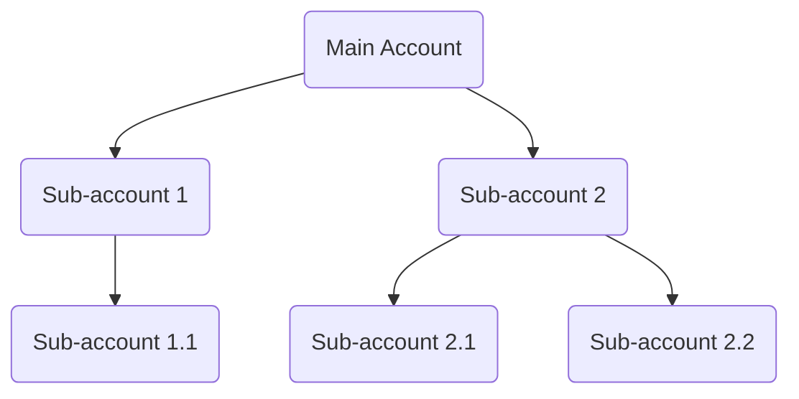

# Logix MVC Accounting APIs Documentation

This documentation provides a comprehensive overview of the Accounting (Acc) API controllers in the Logix MVC solution. Each controller is responsible for a specific domain of the accounting system, such as accounts, cost centers, banks, cash handling, journals, reports, and financial operations. The endpoints are RESTful and require permissions for access, ensuring robust security.

Below you'll find detailed explanations for each controller, including its responsibility, endpoints, usage examples, and data flow diagrams where applicable.

---

## 🌳 **BaseAccApiController**

### Purpose

All accounting API controllers inherit from `BaseAccApiController`. It defines the base route and marks all API controllers as RESTful.

```csharp
[Route($"api/{ApiConfig.ApiVersion}/Acc/[controller]")]
[ApiController]
public abstract class BaseAccApiController : ControllerBase { }
```

---

## 🧾 AccAccountController

### Overview

Manages operations for chart of accounts: searching, CRUD, loading for editing, hierarchical tree, Excel import/export, and reporting.

### Endpoints

| Name                | Method | Route                              | Description                                   |
|---------------------|--------|-------------------------------------|-----------------------------------------------|
| Search              | POST   | /api/v1/Acc/AccAccount/Search       | Searches accounts by filter                   |
| Add                 | POST   | /api/v1/Acc/AccAccount/Add          | Adds a new account                            |
| Edit                | POST   | /api/v1/Acc/AccAccount/Edit         | Edits an existing account                     |
| Delete              | DELETE | /api/v1/Acc/AccAccount/Delete       | Deletes an account                            |
| GetByIdForEdit      | GET    | /api/v1/Acc/AccAccount/GetByIdForEdit | Fetches account for editing                  |
| GetById             | GET    | /api/v1/Acc/AccAccount/GetById      | Gets account by Id                            |
| GetByCode           | GET    | /api/v1/Acc/AccAccount/GetByCode    | Gets account by code                          |
| DDLAccountParentByGroupId | GET | /api/v1/Acc/AccAccount/DDLAccountParentByGroupId | Loads parent accounts for dropdown          |
| ShowUploadAccountsExcel | POST | /api/v1/Acc/AccAccount/ShowUploadAccountsExcel | Validates Excel-uploaded accounts           |
| SaveAccountsExcel   | POST   | /api/v1/Acc/AccAccount/SaveAccountsExcel | Saves validated Excel-uploaded accounts    |
| DeleteAllAccAccounts| DELETE | /api/v1/Acc/AccAccount/DeleteAllAccAccounts | Deletes all accounts (dangerous)           |
| SearchReports       | POST   | /api/v1/Acc/AccAccount/SearchReports | Searches accounts for reports               |

### Usage Examples

#### Search Accounts

```api
{
    "title": "Search Accounts",
    "description": "Search for accounts matching filter criteria.",
    "method": "POST",
    "baseUrl": "https://api.example.com",
    "endpoint": "/api/v1/Acc/AccAccount/Search",
    "headers": [
        { "key": "Authorization", "value": "Bearer <token>", "required": true }
    ],
    "bodyType": "json",
    "requestBody": "{ \"AccAccountName\": \"Cash\", \"AccGroupId\": 1 }",
    "responses": {
        "200": {
            "description": "Success",
            "body": "{ \"data\": [ { \"AccAccountId\": 1, \"AccAccountName\": \"Cash\" } ] }"
        }
    }
}
```

#### Add New Account

```api
{
    "title": "Add Account",
    "description": "Create a new account record.",
    "method": "POST",
    "baseUrl": "https://api.example.com",
    "endpoint": "/api/v1/Acc/AccAccount/Add",
    "headers": [
        { "key": "Authorization", "value": "Bearer <token>", "required": true }
    ],
    "bodyType": "json",
    "requestBody": "{ \"AccAccountName\": \"New Account\", \"AccGroupId\": 2 }",
    "responses": {
        "200": {
            "description": "Created",
            "body": "{ \"success\": true, \"data\": { \"AccAccountId\": 123 } }"
        }
    }
}
```

#### Delete Account

```api
{
    "title": "Delete Account",
    "description": "Delete an account by its ID.",
    "method": "DELETE",
    "baseUrl": "https://api.example.com",
    "endpoint": "/api/v1/Acc/AccAccount/Delete",
    "queryParams": [
        { "key": "Id", "value": "Account Id", "required": true }
    ],
    "headers": [
        { "key": "Authorization", "value": "Bearer <token>", "required": true }
    ],
    "bodyType": "none",
    "responses": {
        "200": {
            "description": "Deleted",
            "body": "{ \"success\": true }"
        },
        "403": {
            "description": "Forbidden",
            "body": "{ \"error\": \"AccessDenied\" }"
        }
    }
}
```

### Data Flow Example

```mermaid
flowchart TD
    SearchRequest-->|Filter|AccAccountController
    AccAccountController-->|Search(filter)|AccAccountService
    AccAccountService-->|Result|AccAccountController
    AccAccountController-->|Result|Client
```

---

## 🏦 AccAccountsCostcenter

### Overview

Handles operations mapping accounts to cost centers, including search, CRUD, and retrieval by account or Id.

### Endpoints

- `POST /api/v1/Acc/AccAccountsCostcenter/Search` — Search account/cost center links
- `POST /api/v1/Acc/AccAccountsCostcenter/Add` — Add link
- `POST /api/v1/Acc/AccAccountsCostcenter/Edit` — Edit link
- `DELETE /api/v1/Acc/AccAccountsCostcenter/Delete` — Delete link by Id
- `GET /api/v1/Acc/AccAccountsCostcenter/GetByIdForEdit` — Retrieve for editing
- `GET /api/v1/Acc/AccAccountsCostcenter/GetById` — Retrieve by Id
- `GET /api/v1/Acc/AccAccountsCostcenter/GetByAccountsId` — Retrieve all cost centers for an account

### Usage Example

#### Search Account-Cost Center Links

```api
{
    "title": "Search Account-Costcenter",
    "description": "Find links between accounts and cost centers.",
    "method": "POST",
    "baseUrl": "https://api.example.com",
    "endpoint": "/api/v1/Acc/AccAccountsCostcenter/Search",
    "headers": [
        { "key": "Authorization", "value": "Bearer <token>", "required": true }
    ],
    "bodyType": "json",
    "requestBody": "{ \"AccAccountId\": 101 }",
    "responses": {
        "200": {
            "description": "Success",
            "body": "{ \"data\": [ { \"Id\": 1, \"AccAccountId\": 101, \"CcId\": 5 } ] }"
        }
    }
}
```

---

## 🏦 ACCBankUsersApiController

### Overview

Manages user permissions for bank records.

### Endpoints

- `GET /api/v1/Acc/ACCBankUsersApi/GetUsersPermissionACCBank` — Get users with permissions on a bank
- `POST /api/v1/Acc/ACCBankUsersApi/Edit` — Set users with permission
- `DELETE /api/v1/Acc/ACCBankUsersApi/Delete` — Remove a user's permission from a bank

### Usage Example

#### Get Users with Bank Permission

```api
{
    "title": "Get Users Permission for Bank",
    "description": "Get users who have permission for a bank account.",
    "method": "GET",
    "baseUrl": "https://api.example.com",
    "endpoint": "/api/v1/Acc/ACCBankUsersApi/GetUsersPermissionACCBank",
    "queryParams": [
        { "key": "id", "value": "Bank Id", "required": true }
    ],
    "headers": [
        { "key": "Authorization", "value": "Bearer <token>", "required": true }
    ],
    "bodyType": "none",
    "responses": {
        "200": {
            "description": "Success",
            "body": "{ \"data\": [ { \"Id\": 1, \"Name\": \"John\" } ] }"
        }
    }
}
```

---

## 📊 AccAccountsTreeController

### Overview

Provides tree-structured data of the chart of accounts.

### Endpoints

- `GET /api/v1/Acc/AccAccountsTree/AccountsTree` — Retrieves the full accounts tree

### Usage Example

```api
{
    "title": "Get Accounts Tree",
    "description": "Get tree structure of all accounts.",
    "method": "GET",
    "baseUrl": "https://api.example.com",
    "endpoint": "/api/v1/Acc/AccAccountsTree/AccountsTree",
    "headers": [
        { "key": "Authorization", "value": "Bearer <token>", "required": true }
    ],
    "bodyType": "none",
    "responses": {
        "200": {
            "description": "Success",
            "body": "{ \"data\": [ { \"AccountId\": 1, \"AccountName\": \"Assets\", \"Children\": [ ... ] } ] }"
        }
    }
}
```

#### Accounts Tree Diagram



---

## 🏷️ ACCCostCenterController

### Overview

CRUD and search for cost centers.

### Endpoints

- `POST /api/v1/Acc/ACCCostCenter/Search` — Search cost centers
- `POST /api/v1/Acc/ACCCostCenter/Add` — Add new cost center
- `POST /api/v1/Acc/ACCCostCenter/Edit` — Edit cost center
- `DELETE /api/v1/Acc/ACCCostCenter/Delete` — Delete cost center
- `GET /api/v1/Acc/ACCCostCenter/GetByIdForEdit` — Get for edit
- `GET /api/v1/Acc/ACCCostCenter/GetById` — Get by Id

### Usage Example

```api
{
    "title": "Add Cost Center",
    "description": "Add a new cost center.",
    "method": "POST",
    "baseUrl": "https://api.example.com",
    "endpoint": "/api/v1/Acc/ACCCostCenter/Add",
    "headers": [
        { "key": "Authorization", "value": "Bearer <token>", "required": true }
    ],
    "bodyType": "json",
    "requestBody": "{ \"CostCenterName\": \"IT Center\" }",
    "responses": {
        "200": {
            "description": "Success",
            "body": "{ \"success\": true, \"data\": { \"CcId\": 5 } }"
        }
    }
}
```

---

## 💰 AccBankController

### Overview

CRUD, search, and retrieval for bank accounts.

### Endpoints

- `GET /api/v1/Acc/AccBank/GetAll` — All banks
- `POST /api/v1/Acc/AccBank/Search` — Search
- `POST /api/v1/Acc/AccBank/Add` — Add
- `POST /api/v1/Acc/AccBank/Edit` — Edit
- `DELETE /api/v1/Acc/AccBank/Delete` — Delete
- `GET /api/v1/Acc/AccBank/GetByIdForEdit` — Get for edit
- `GET /api/v1/Acc/AccBank/GetById` — Get by Id

### Usage Example

```api
{
    "title": "Get All Banks",
    "description": "Retrieve all banks.",
    "method": "GET",
    "baseUrl": "https://api.example.com",
    "endpoint": "/api/v1/Acc/AccBank/GetAll",
    "headers": [
        { "key": "Authorization", "value": "Bearer <token>", "required": true }
    ],
    "bodyType": "none",
    "responses": {
        "200": {
            "description": "Success",
            "body": "{ \"data\": [ { \"BankId\": 1, \"BankName\": \"My Bank\" } ] }"
        }
    }
}
```

---

## 🏦 AccCashOnHandController

### Overview

Manages cash on hand (petty cash) accounts.

### Endpoints

- `GET /api/v1/Acc/AccCashOnHand/GetAll`
- `POST /api/v1/Acc/AccCashOnHand/Search`
- `POST /api/v1/Acc/AccCashOnHand/Add`
- `POST /api/v1/Acc/AccCashOnHand/Edit`
- `DELETE /api/v1/Acc/AccCashOnHand/Delete`
- `GET /api/v1/Acc/AccCashOnHand/GetByIdForEdit`
- `GET /api/v1/Acc/AccCashOnHand/GetById`

### Usage Example

```api
{
    "title": "Get Cash On Hand By Id",
    "description": "Fetch a cash on hand record by Id.",
    "method": "GET",
    "baseUrl": "https://api.example.com",
    "endpoint": "/api/v1/Acc/AccCashOnHand/GetById",
    "queryParams": [
        { "key": "id", "value": "Cash Account Id", "required": true }
    ],
    "headers": [
        { "key": "Authorization", "value": "Bearer <token>", "required": true }
    ],
    "bodyType": "none",
    "responses": {
        "200": {
            "description": "Success",
            "body": "{ \"data\": { \"Id\": 8, \"Name\": \"Main Cash\" } }"
        }
    }
}
```

---

## 🧾 AccChequeBookApiController

### Overview

Manages cheque books associated with bank accounts.

### Endpoints

- `GET /api/v1/Acc/AccChequeBookApi/GetAll`
- `GET /api/v1/Acc/AccChequeBookApi/GetByBankAll`
- `POST /api/v1/Acc/AccChequeBookApi/Add`
- `POST /api/v1/Acc/AccChequeBookApi/Edit`
- `POST /api/v1/Acc/AccChequeBookApi/Delete`
- `GET /api/v1/Acc/AccChequeBookApi/GetByIdForEdit`
- `GET /api/v1/Acc/AccChequeBookApi/GetById`

### Usage Example

```api
{
    "title": "Add Cheque Book",
    "description": "Add a cheque book for a bank account.",
    "method": "POST",
    "baseUrl": "https://api.example.com",
    "endpoint": "/api/v1/Acc/AccChequeBookApi/Add",
    "headers": [
        { "key": "Authorization", "value": "Bearer <token>", "required": true }
    ],
    "bodyType": "json",
    "requestBody": "{ \"BankId\": 1, \"StartNo\": \"1001\", \"EndNo\": \"1100\" }",
    "responses": {
        "200": {
            "description": "Created",
            "body": "{ \"success\": true }"
        }
    }
}
```

---

## 🏛️ AccAccountsLevelController

### Overview

Handles the management and update of account levels (the digit/structure of account numbers).

### Endpoints

- `GET /api/v1/Acc/AccAccountsLevel/GetAll` — List levels
- `POST /api/v1/Acc/AccAccountsLevel/Edit` — Update digit count and color for a level

### Usage Example

```api
{
    "title": "Update Account Level Digits",
    "description": "Update the digit count and color for an account level.",
    "method": "POST",
    "baseUrl": "https://api.example.com",
    "endpoint": "/api/v1/Acc/AccAccountsLevel/Edit",
    "headers": [
        { "key": "Authorization", "value": "Bearer <token>", "required": true }
    ],
    "bodyType": "json",
    "requestBody": "{ \"LevelId\": 3, \"NoOfDigit\": 5, \"Color\": \"#0000ff\" }",
    "responses": {
        "200": {
            "description": "Updated",
            "body": "{ \"success\": true }"
        }
    }
}
```

---

## 🧑‍💼 ACCCashonhandUsersApiController

### Overview

Manages user assignments to cash on hand records.

### Endpoints

- `GET /api/v1/Acc/ACCCashonhandUsersApi/GetUsersPermissionAccCashonhand`
- `POST /api/v1/Acc/ACCCashonhandUsersApi/Edit`
- `DELETE /api/v1/Acc/ACCCashonhandUsersApi/Delete`

### Usage Example

```api
{
    "title": "Get Users for Cash On Hand",
    "description": "Get users with permissions for a cash on hand record.",
    "method": "GET",
    "baseUrl": "https://api.example.com",
    "endpoint": "/api/v1/Acc/ACCCashonhandUsersApi/GetUsersPermissionAccCashonhand",
    "queryParams": [
        { "key": "id", "value": "Cash Account Id", "required": true }
    ],
    "headers": [
        { "key": "Authorization", "value": "Bearer <token>", "required": true }
    ],
    "bodyType": "none",
    "responses": {
        "200": {
            "description": "Success",
            "body": "{ \"data\": [ { \"Id\": 1, \"Name\": \"Alice\" } ] }"
        }
    }
}
```

---

## 🌳 AccCostCenterTreeApiController

### Overview

Returns a tree structure of all cost centers.

### Endpoints

- `GET /api/v1/Acc/AccCostCenterTreeApi/CostCentertTree`
- `GET /api/v1/Acc/AccCostCenterTreeApi/GetById`
- `GET /api/v1/Acc/AccCostCenterTreeApi/GetByload`
- `POST /api/v1/Acc/AccCostCenterTreeApi/Edit`
- `DELETE /api/v1/Acc/AccCostCenterTreeApi/Delete`

### Usage Example

```api
{
    "title": "Get Cost Center Tree",
    "description": "Return a tree of all cost centers for the facility.",
    "method": "GET",
    "baseUrl": "https://api.example.com",
    "endpoint": "/api/v1/Acc/AccCostCenterTreeApi/CostCentertTree",
    "headers": [
        { "key": "Authorization", "value": "Bearer <token>", "required": true }
    ],
    "bodyType": "none",
    "responses": {
        "200": {
            "description": "Tree",
            "body": "{ \"data\": [ { \"CcId\": 1, \"CostCenterName\": \"Projects\", \"Children\": [ ... ] } ] }"
        }
    }
}
```

---

## 🏢 AccFacilitiesApiController

### Overview

Facility management endpoints for searching, retrieving, and updating facility data and profile.

### Endpoints

- `POST /api/v1/Acc/AccFacilitiesApi/Search`
- `POST /api/v1/Acc/AccFacilitiesApi/GetAll`
- `GET /api/v1/Acc/AccFacilitiesApi/GetByIdForEdit`
- `POST /api/v1/Acc/AccFacilitiesApi/Edit`
- `GET /api/v1/Acc/AccFacilitiesApi/GetFacilityStamp`
- `GET /api/v1/Acc/AccFacilitiesApi/EditStamp`
- `POST /api/v1/Acc/AccFacilitiesApi/GetMyFacilityProfile`
- `POST /api/v1/Acc/AccFacilitiesApi/EditProfile`
- `POST /api/v1/Acc/AccFacilitiesApi/GetAccFacility`

### Usage Example

```api
{
    "title": "Get Facility Profile",
    "description": "Get the profile of the current facility.",
    "method": "POST",
    "baseUrl": "https://api.example.com",
    "endpoint": "/api/v1/Acc/AccFacilitiesApi/GetMyFacilityProfile",
    "headers": [
        { "key": "Authorization", "value": "Bearer <token>", "required": true }
    ],
    "bodyType": "none",
    "responses": {
        "200": {
            "description": "Facility profile",
            "body": "{ \"data\": { \"FacilityId\": 1, \"FacilityName\": \"ABC Corp\" } }"
        }
    }
}
```

---

## 📊 AccFirstTimeBalancesApiController

### Overview

Manages first time balances (opening balances) for a financial year.

### Endpoints

- `GET /api/v1/Acc/AccFirstTimeBalancesApi/GetAll`
- `POST /api/v1/Acc/AccFirstTimeBalancesApi/Search`
- `POST /api/v1/Acc/AccFirstTimeBalancesApi/Add`
- `POST /api/v1/Acc/AccFirstTimeBalancesApi/Edit`
- `DELETE /api/v1/Acc/AccFirstTimeBalancesApi/Delete`
- `GET /api/v1/Acc/AccFirstTimeBalancesApi/GetByIdForEdit`
- `GET /api/v1/Acc/AccFirstTimeBalancesApi/GetById`

### Usage Example

```api
{
    "title": "Add First Time Balance",
    "description": "Create a new first time balance entry.",
    "method": "POST",
    "baseUrl": "https://api.example.com",
    "endpoint": "/api/v1/Acc/AccFirstTimeBalancesApi/Add",
    "headers": [
        { "key": "Authorization", "value": "Bearer <token>", "required": true }
    ],
    "bodyType": "json",
    "requestBody": "{ \"JCode\": \"FTB-2024\", \"Amount\": 10000 }",
    "responses": {
        "200": {
            "description": "Created",
            "body": "{ \"success\": true }"
        }
    }
}
```

---

## Full API Reference (All Endpoints, Methods, Parameters, Returns)

### Notes

- All endpoints return a standardized Result wrapper with success, data, and message.
- 403 responses indicate AccessDenied when permission checks fail.
- 400/404 are returned as meaningful error payloads when applicable.

---

## AccAccountController — Full Endpoint Blocks

```api
{
  "title": "Get Account By Id For Edit",
  "description": "Get an account with all fields needed for editing.",
  "method": "GET",
  "baseUrl": "https://api.example.com",
  "endpoint": "/api/v1/Acc/AccAccount/GetByIdForEdit",
  "queryParams": [
    { "key": "id", "value": "Account Id", "required": true }
  ],
  "bodyType": "none",
  "responses": {
    "200": {
      "description": "Found",
      "body": "{ \"data\": { \"AccAccountId\": 10, \"AccAccountName\": \"Cash\" } }"
    },
    "400": {
      "description": "Validation error",
      "body": "{ \"success\": false, \"message\": \"NoIdInUpdate\" }"
    }
  }
}
```

```api
{
  "title": "Get Account By Id",
  "description": "Retrieve basic account data by id.",
  "method": "GET",
  "baseUrl": "https://api.example.com",
  "endpoint": "/api/v1/Acc/AccAccount/GetById",
  "queryParams": [
    { "key": "id", "value": "Account Id", "required": true }
  ],
  "bodyType": "none",
  "responses": {
    "200": { "description": "Success", "body": "{ \"data\": { \"AccAccountId\": 10 } }" },
    "403": { "description": "Forbidden", "body": "{ \"message\": \"AcessDenied\" }" }
  }
}
```

```api
{
  "title": "Get Account Level Value",
  "description": "Return next account level value for an account id.",
  "method": "GET",
  "baseUrl": "https://api.example.com",
  "endpoint": "/api/v1/Acc/AccAccount/GetAccountLevelValue",
  "queryParams": [
    { "key": "id", "value": "Account Id", "required": true }
  ],
  "bodyType": "none",
  "responses": {
    "200": { "description": "Success", "body": "{ \"data\": 3 }" }
  }
}
```

```api
{
  "title": "DDL Account Parent By Group Id",
  "description": "Get a hierarchical SelectList of parent accounts for a specific group.",
  "method": "GET",
  "baseUrl": "https://api.example.com",
  "endpoint": "/api/v1/Acc/AccAccount/DDLAccountParentByGroupId",
  "queryParams": [
    { "key": "Id", "value": "Group Id", "required": true }
  ],
  "bodyType": "none",
  "responses": {
    "200": { "description": "Select list", "body": "{ \"data\": { \"items\": [ ] } }" }
  }
}
```

```api
{
  "title": "Get Account By Code",
  "description": "Get account view by account code.",
  "method": "GET",
  "baseUrl": "https://api.example.com",
  "endpoint": "/api/v1/Acc/AccAccount/GetByCode",
  "queryParams": [
    { "key": "Code", "value": "Account Code", "required": true }
  ],
  "bodyType": "none",
  "responses": {
    "200": { "description": "Found", "body": "{ \"data\": { \"AccAccountCode\": \"100101\" } }" },
    "400": { "description": "Missing", "body": "{ \"success\": false, \"message\": \"NoIdInUpdate\" }" }
  }
}
```

```api
{
  "title": "Get Currency ID",
  "description": "Get currency id or level related numeric value for account id.",
  "method": "GET",
  "baseUrl": "https://api.example.com",
  "endpoint": "/api/v1/Acc/AccAccount/GetCurrencyID",
  "queryParams": [
    { "key": "id", "value": "Account Id", "required": true }
  ],
  "bodyType": "none",
  "responses": {
    "200": { "description": "Success", "body": "{ \"data\": 2 }" }
  }
}
```

```api
{
  "title": "Show Upload Accounts Excel",
  "description": "Validate uploaded accounts from Excel before saving.",
  "method": "POST",
  "baseUrl": "https://api.example.com",
  "endpoint": "/api/v1/Acc/AccAccount/ShowUploadAccountsExcel",
  "headers": [
    { "key": "Authorization", "value": "Bearer <token>", "required": true },
    { "key": "Content-Type", "value": "application/json", "required": true }
  ],
  "bodyType": "json",
  "requestBody": "[ { \"AccAccountCode\": \"100101\", \"AccAccountName\": \"Cash\", \"AccountLevel\": 2 } ]",
  "responses": {
    "200": { "description": "Valid or error list", "body": "{ \"data\": [ ], \"message\": \"...\" }" }
  }
}
```

```api
{
  "title": "Save Accounts Excel",
  "description": "Persist the previously validated excel accounts tree.",
  "method": "POST",
  "baseUrl": "https://api.example.com",
  "endpoint": "/api/v1/Acc/AccAccount/SaveAccountsExcel",
  "headers": [
    { "key": "Authorization", "value": "Bearer <token>", "required": true }
  ],
  "bodyType": "json",
  "requestBody": "[ { \"AccAccountCode\": \"100101\", \"AccAccountName\": \"Cash\", \"Children\": [] } ]",
  "responses": {
    "200": { "description": "Saved", "body": "{ \"success\": true }" },
    "400": { "description": "Import error", "body": "{ \"success\": false, \"message\": \"ImportError\" }" }
  }
}
```

```api
{
  "title": "Delete All Accounts",
  "description": "Dangerous: remove all accounts for facility/system.",
  "method": "DELETE",
  "baseUrl": "https://api.example.com",
  "endpoint": "/api/v1/Acc/AccAccount/DeleteAllAccAccounts",
  "bodyType": "none",
  "responses": {
    "200": { "description": "Done", "body": "{ \"success\": true }" }
  }
}
```

```api
{
  "title": "Search Accounts Reports",
  "description": "Get accounts for reporting views.",
  "method": "POST",
  "baseUrl": "https://api.example.com",
  "endpoint": "/api/v1/Acc/AccAccount/SearchReports",
  "bodyType": "none",
  "responses": {
    "200": { "description": "List", "body": "{ \"data\": [ { \"AccAccountCode\": \"100101\" } ] }" }
  }
}
```

---

## AccAccountsCostcenter — Full Endpoint Blocks

```api
{
  "title": "Add Account-CostCenter link",
  "description": "Create a link between an account and a cost center with rules.",
  "method": "POST",
  "baseUrl": "https://api.example.com",
  "endpoint": "/api/v1/Acc/AccAccountsCostcenter/Add",
  "bodyType": "json",
  "requestBody": "{ \"AccAccountId\": 10, \"CcId\": 5, \"CcNo\": 1, \"IsRequired\": true }",
  "responses": {
    "200": { "description": "Created", "body": "{ \"success\": true }" }
  }
}
```

```api
{
  "title": "Edit Account-CostCenter link",
  "description": "Update an existing mapping between account and cost center.",
  "method": "POST",
  "baseUrl": "https://api.example.com",
  "endpoint": "/api/v1/Acc/AccAccountsCostcenter/Edit",
  "bodyType": "json",
  "requestBody": "{ \"Id\": 1, \"IsRequired\": false }",
  "responses": {
    "200": { "description": "Updated", "body": "{ \"success\": true }" }
  }
}
```

```api
{
  "title": "Delete Account-CostCenter link",
  "description": "Remove a mapping by id.",
  "method": "DELETE",
  "baseUrl": "https://api.example.com",
  "endpoint": "/api/v1/Acc/AccAccountsCostcenter/Delete",
  "queryParams": [
    { "key": "Id", "value": "Link Id", "required": true }
  ],
  "bodyType": "none",
  "responses": {
    "200": { "description": "Deleted", "body": "{ \"success\": true }" }
  }
}
```

```api
{
  "title": "Get Account-CostCenter for Edit",
  "description": "Fetch mapping by id with edit fields.",
  "method": "GET",
  "baseUrl": "https://api.example.com",
  "endpoint": "/api/v1/Acc/AccAccountsCostcenter/GetByIdForEdit",
  "queryParams": [
    { "key": "id", "value": "Mapping Id", "required": true }
  ],
  "bodyType": "none",
  "responses": {
    "200": { "description": "Found", "body": "{ \"data\": { \"Id\": 1, \"CcId\": 5 } }" }
  }
}
```

```api
{
  "title": "Get Account-CostCenter by Id",
  "description": "Fetch a mapping by id.",
  "method": "GET",
  "baseUrl": "https://api.example.com",
  "endpoint": "/api/v1/Acc/AccAccountsCostcenter/GetById",
  "queryParams": [
    { "key": "id", "value": "Mapping Id", "required": true }
  ],
  "bodyType": "none",
  "responses": {
    "200": { "description": "Found", "body": "{ \"data\": { \"Id\": 1 } }" }
  }
}
```

```api
{
  "title": "Get CostCenters by AccountId",
  "description": "List all cost centers linked to an account.",
  "method": "GET",
  "baseUrl": "https://api.example.com",
  "endpoint": "/api/v1/Acc/AccAccountsCostcenter/GetByAccountsId",
  "queryParams": [
    { "key": "id", "value": "Account Id", "required": true }
  ],
  "bodyType": "none",
  "responses": {
    "200": { "description": "List", "body": "{ \"data\": [ { \"CcId\": 5 } ] }" }
  }
}
```

---

## ACCBankUsersApiController — Full Endpoint Blocks

```api
{
  "title": "Update Bank Users Permission",
  "description": "Replace the allowed users list for a bank (comma-separated ids).",
  "method": "POST",
  "baseUrl": "https://api.example.com",
  "endpoint": "/api/v1/Acc/ACCBankUsersApi/Edit",
  "bodyType": "json",
  "requestBody": "{ \"BankID\": 1, \"UsersPermission\": \"2,3,5\" }",
  "responses": {
    "200": { "description": "Updated", "body": "{ \"success\": true }" }
  }
}
```

```api
{
  "title": "Remove User from Bank Permission",
  "description": "Remove a single user id from the permission list of a bank.",
  "method": "DELETE",
  "baseUrl": "https://api.example.com",
  "endpoint": "/api/v1/Acc/ACCBankUsersApi/Delete",
  "queryParams": [
    { "key": "BankId", "value": "Bank Id", "required": true },
    { "key": "Id", "value": "User Id", "required": true }
  ],
  "bodyType": "none",
  "responses": {
    "200": { "description": "Removed", "body": "{ \"success\": true }" }
  }
}
```

---

## AccChequeBookApiController — Full Endpoint Blocks

```api
{
  "title": "List Cheque Books",
  "description": "Get all cheque books.",
  "method": "GET",
  "baseUrl": "https://api.example.com",
  "endpoint": "/api/v1/Acc/AccChequeBookApi/GetAll",
  "bodyType": "none",
  "responses": {
    "200": { "description": "List", "body": "{ \"data\": [ { \"Id\": 1 } ] }" }
  }
}
```

```api
{
  "title": "List Cheque Books for Bank",
  "description": "Get all cheque books for a specific bank id.",
  "method": "GET",
  "baseUrl": "https://api.example.com",
  "endpoint": "/api/v1/Acc/AccChequeBookApi/GetByBankAll",
  "queryParams": [
    { "key": "BankId", "value": "Bank Id", "required": true }
  ],
  "bodyType": "none",
  "responses": {
    "200": { "description": "List", "body": "{ \"data\": [ { \"Id\": 1 } ] }" }
  }
}
```

```api
{
  "title": "Edit Cheque Book",
  "description": "Update a cheque book details.",
  "method": "POST",
  "baseUrl": "https://api.example.com",
  "endpoint": "/api/v1/Acc/AccChequeBookApi/Edit",
  "bodyType": "json",
  "requestBody": "{ \"Id\": 1, \"StartNo\": \"2001\", \"EndNo\": \"2100\" }",
  "responses": {
    "200": { "description": "Updated", "body": "{ \"success\": true }" }
  }
}
```

```api
{
  "title": "Delete Cheque Book",
  "description": "Delete a cheque book by id (uses POST by design).",
  "method": "POST",
  "baseUrl": "https://api.example.com",
  "endpoint": "/api/v1/Acc/AccChequeBookApi/Delete",
  "bodyType": "json",
  "requestBody": "{ \"Id\": 1 }",
  "responses": {
    "200": { "description": "Deleted", "body": "{ \"success\": true }" }
  }
}
```

```api
{
  "title": "Get Cheque Book For Edit",
  "description": "Fetch a cheque book with required edit fields.",
  "method": "GET",
  "baseUrl": "https://api.example.com",
  "endpoint": "/api/v1/Acc/AccChequeBookApi/GetByIdForEdit",
  "queryParams": [
    { "key": "id", "value": "Cheque Book Id", "required": true }
  ],
  "bodyType": "none",
  "responses": {
    "200": { "description": "Found", "body": "{ \"data\": { \"Id\": 1 } }" }
  }
}
```

```api
{
  "title": "Get Cheque Book",
  "description": "Get cheque book by id.",
  "method": "GET",
  "baseUrl": "https://api.example.com",
  "endpoint": "/api/v1/Acc/AccChequeBookApi/GetById",
  "queryParams": [
    { "key": "id", "value": "Cheque Book Id", "required": true }
  ],
  "bodyType": "none",
  "responses": {
    "200": { "description": "Found", "body": "{ \"data\": { \"Id\": 1 } }" }
  }
}
```

---

## AccAccountsLevelController — Full Endpoint Blocks

```api
{
  "title": "List Account Levels",
  "description": "Get all account levels configuration.",
  "method": "GET",
  "baseUrl": "https://api.example.com",
  "endpoint": "/api/v1/Acc/AccAccountsLevel/GetAll",
  "bodyType": "none",
  "responses": {
    "200": { "description": "Levels", "body": "{ \"data\": [ { \"LevelId\": 1, \"NoOfDigit\": 2 } ] }" }
  }
}
```

```api
{
  "title": "Update Level Digit and Color",
  "description": "Update the number of digits and color for a given level id.",
  "method": "POST",
  "baseUrl": "https://api.example.com",
  "endpoint": "/api/v1/Acc/AccAccountsLevel/Edit",
  "bodyType": "json",
  "requestBody": "{ \"LevelId\": 2, \"NoOfDigit\": 3, \"Color\": \"#ff9900\" }",
  "responses": {
    "200": { "description": "Updated", "body": "{ \"success\": true }" }
  }
}
```

---

## ACCCashonhandUsersApiController — Full Endpoint Blocks

```api
{
  "title": "Update CashOnHand Users Permission",
  "description": "Set users allowed for a cash on hand account (comma-separated ids).",
  "method": "POST",
  "baseUrl": "https://api.example.com",
  "endpoint": "/api/v1/Acc/ACCCashonhandUsersApi/Edit",
  "bodyType": "json",
  "requestBody": "{ \"ID\": 8, \"UsersPermission\": \"4,6\" }",
  "responses": {
    "200": { "description": "Updated", "body": "{ \"success\": true }" }
  }
}
```

```api
{
  "title": "Remove User From CashOnHand",
  "description": "Delete a user from permissions on a cash on hand record.",
  "method": "DELETE",
  "baseUrl": "https://api.example.com",
  "endpoint": "/api/v1/Acc/ACCCashonhandUsersApi/Delete",
  "queryParams": [
    { "key": "CashId", "value": "Cash record Id", "required": true },
    { "key": "Id", "value": "User Id", "required": true }
  ],
  "bodyType": "none",
  "responses": {
    "200": { "description": "Removed", "body": "{ \"success\": true }" }
  }
}
```

---

## AccCostCenterTreeApiController — Full Endpoint Blocks

```api
{
  "title": "Get Cost Center By Id",
  "description": "Fetch a cost center by id for edit view.",
  "method": "GET",
  "baseUrl": "https://api.example.com",
  "endpoint": "/api/v1/Acc/AccCostCenterTreeApi/GetById",
  "queryParams": [
    { "key": "id", "value": "Cost center id", "required": true }
  ],
  "bodyType": "none",
  "responses": {
    "200": { "description": "Found", "body": "{ \"data\": { \"CcId\": 10 } }" }
  }
}
```

```api
{
  "title": "Get First Cost Center",
  "description": "Load first cost center for edit on initial load.",
  "method": "GET",
  "baseUrl": "https://api.example.com",
  "endpoint": "/api/v1/Acc/AccCostCenterTreeApi/GetByload",
  "bodyType": "none",
  "responses": {
    "200": { "description": "Found", "body": "{ \"data\": { \"CcId\": 1 } }" }
  }
}
```

```api
{
  "title": "Edit Cost Center",
  "description": "Update a cost center data.",
  "method": "POST",
  "baseUrl": "https://api.example.com",
  "endpoint": "/api/v1/Acc/AccCostCenterTreeApi/Edit",
  "bodyType": "json",
  "requestBody": "{ \"CcId\": 10, \"CostCenterName\": \"Projects\" }",
  "responses": {
    "200": { "description": "Updated", "body": "{ \"success\": true }" }
  }
}
```

```api
{
  "title": "Delete Cost Center",
  "description": "Delete a cost center by id (checks for children).",
  "method": "DELETE",
  "baseUrl": "https://api.example.com",
  "endpoint": "/api/v1/Acc/AccCostCenterTreeApi/Delete",
  "queryParams": [
    { "key": "Id", "value": "Cost center id", "required": true }
  ],
  "bodyType": "none",
  "responses": {
    "200": { "description": "Deleted", "body": "{ \"success\": true }" },
    "400": { "description": "Has children", "body": "{ \"success\": false, \"message\": \"chkCostCenterParentId\" }" }
  }
}
```

---

## AccFacilitiesApiController — Full Endpoint Blocks

```api
{
  "title": "Search Facilities",
  "description": "Search facility records using various filters.",
  "method": "POST",
  "baseUrl": "https://api.example.com",
  "endpoint": "/api/v1/Acc/AccFacilitiesApi/Search",
  "bodyType": "json",
  "requestBody": "{ \"FacilityName\": \"Corp\", \"IdNumber\": \"123\" }",
  "responses": {
    "200": { "description": "List", "body": "{ \"data\": [ { \"FacilityId\": 1 } ] }" }
  }
}
```

```api
{
  "title": "Get All Facilities",
  "description": "List all facilities.",
  "method": "POST",
  "baseUrl": "https://api.example.com",
  "endpoint": "/api/v1/Acc/AccFacilitiesApi/GetAll",
  "bodyType": "none",
  "responses": {
    "200": { "description": "List", "body": "{ \"data\": [ { \"FacilityId\": 1 } ] }" }
  }
}
```

```api
{
  "title": "Get Facility By Id For Edit",
  "description": "Get facility data formatted for edit view.",
  "method": "GET",
  "baseUrl": "https://api.example.com",
  "endpoint": "/api/v1/Acc/AccFacilitiesApi/GetByIdForEdit",
  "queryParams": [
    { "key": "id", "value": "Facility Id", "required": true }
  ],
  "bodyType": "none",
  "responses": {
    "200": { "description": "Found", "body": "{ \"data\": { \"FacilityId\": 1 } }" }
  }
}
```

```api
{
  "title": "Edit Facility",
  "description": "Update facility core fields.",
  "method": "POST",
  "baseUrl": "https://api.example.com",
  "endpoint": "/api/v1/Acc/AccFacilitiesApi/Edit",
  "bodyType": "json",
  "requestBody": "{ \"FacilityId\": 1, \"FacilityName\": \"New Name\" }",
  "responses": {
    "200": { "description": "Updated", "body": "{ \"success\": true }" }
  }
}
```

```api
{
  "title": "Get Facility Stamp",
  "description": "Return the URL of the facility stamp image if any.",
  "method": "GET",
  "baseUrl": "https://api.example.com",
  "endpoint": "/api/v1/Acc/AccFacilitiesApi/GetFacilityStamp",
  "queryParams": [
    { "key": "id", "value": "Facility Id", "required": true }
  ],
  "bodyType": "none",
  "responses": {
    "200": { "description": "Stamp", "body": "{ \"data\": \"https://.../stamp.png\" }" }
  }
}
```

```api
{
  "title": "Update Facility Stamp",
  "description": "Replace the facility stamp by URL string.",
  "method": "GET",
  "baseUrl": "https://api.example.com",
  "endpoint": "/api/v1/Acc/AccFacilitiesApi/EditStamp",
  "queryParams": [
    { "key": "id", "value": "Facility Id", "required": true },
    { "key": "newStampUrl", "value": "New stamp URL", "required": true }
  ],
  "bodyType": "none",
  "responses": {
    "200": { "description": "Updated", "body": "{ \"success\": true }" }
  }
}
```

```api
{
  "title": "Get My Facility Profile",
  "description": "Return the calling user's facility profile for edit.",
  "method": "POST",
  "baseUrl": "https://api.example.com",
  "endpoint": "/api/v1/Acc/AccFacilitiesApi/GetMyFacilityProfile",
  "bodyType": "none",
  "responses": {
    "200": { "description": "Profile", "body": "{ \"data\": { \"FacilityId\": 1 } }" }
  }
}
```

```api
{
  "title": "Edit Facility Profile",
  "description": "Update facility profile fields.",
  "method": "POST",
  "baseUrl": "https://api.example.com",
  "endpoint": "/api/v1/Acc/AccFacilitiesApi/EditProfile",
  "bodyType": "json",
  "requestBody": "{ \"FacilityId\": 1, \"Email\": \"mail@corp.com\" }",
  "responses": {
    "200": { "description": "Updated", "body": "{ \"success\": true }" }
  }
}
```

```api
{
  "title": "Get Current Facility View",
  "description": "Gets facility view record for current session.",
  "method": "POST",
  "baseUrl": "https://api.example.com",
  "endpoint": "/api/v1/Acc/AccFacilitiesApi/GetAccFacility",
  "bodyType": "none",
  "responses": {
    "200": { "description": "Facility", "body": "{ \"data\": { \"FacilityId\": 1 } }" }
  }
}
```

---

## AccFirstTimeBalancesApiController — Full Endpoint Blocks

```api
{
  "title": "List First Time Balances",
  "description": "List all first time balance journals for current year and facility.",
  "method": "GET",
  "baseUrl": "https://api.example.com",
  "endpoint": "/api/v1/Acc/AccFirstTimeBalancesApi/GetAll",
  "bodyType": "none",
  "responses": {
    "200": { "description": "List", "body": "{ \"data\": [ { \"JId\": 1 } ] }" }
  }
}
```

```api
{
  "title": "Search First Time Balances",
  "description": "Search first time balance journals by filters including date ranges and details.",
  "method": "POST",
  "baseUrl": "https://api.example.com",
  "endpoint": "/api/v1/Acc/AccFirstTimeBalancesApi/Search",
  "bodyType": "json",
  "requestBody": "{ \"JCode\": \"001\", \"BranchId\": 0 }",
  "responses": {
    "200": { "description": "List", "body": "{ \"data\": [ { \"JId\": 2 } ] }" }
  }
}
```

```api
{
  "title": "Add First Time Balance",
  "description": "Create first time balance journal with details in body object.",
  "method": "POST",
  "baseUrl": "https://api.example.com",
  "endpoint": "/api/v1/Acc/AccFirstTimeBalancesApi/Add",
  "bodyType": "json",
  "requestBody": "{ \"AccJournalMasterDto\": { \"JCode\": \"FTB-1\" }, \"DetailsList\": [ ] }",
  "responses": {
    "200": { "description": "Created", "body": "{ \"success\": true, \"data\": { \"JId\": 5 } }" }
  }
}
```

```api
{
  "title": "Edit First Time Balance",
  "description": "Update an existing first time balance journal and details.",
  "method": "POST",
  "baseUrl": "https://api.example.com",
  "endpoint": "/api/v1/Acc/AccFirstTimeBalancesApi/Edit",
  "bodyType": "json",
  "requestBody": "{ \"AccJournalMasterDto\": { \"JId\": 5 }, \"DetailsList\": [ ] }",
  "responses": {
    "200": { "description": "Updated", "body": "{ \"success\": true }" }
  }
}
```

```api
{
  "title": "Delete First Time Balance",
  "description": "Delete a first time balance journal by id.",
  "method": "DELETE",
  "baseUrl": "https://api.example.com",
  "endpoint": "/api/v1/Acc/AccFirstTimeBalancesApi/Delete",
  "queryParams": [
    { "key": "Id", "value": "Journal Id", "required": true }
  ],
  "bodyType": "none",
  "responses": { "200": { "description": "Deleted", "body": "{ \"success\": true }" } }
}
```

```api
{
  "title": "Get First Time Balance For Edit",
  "description": "Get journal master plus details for editing.",
  "method": "GET",
  "baseUrl": "https://api.example.com",
  "endpoint": "/api/v1/Acc/AccFirstTimeBalancesApi/GetByIdForEdit",
  "queryParams": [
    { "key": "id", "value": "Journal Id", "required": true }
  ],
  "bodyType": "none",
  "responses": { "200": { "description": "Found", "body": "{ \"data\": { \"AccJournalMasterDto\": { \"JId\": 5 }, \"DetailsList\": [ ] } }" } }
}
```

```api
{
  "title": "Get First Time Balance",
  "description": "Fetch journal master by id (no details).",
  "method": "GET",
  "baseUrl": "https://api.example.com",
  "endpoint": "/api/v1/Acc/AccFirstTimeBalancesApi/GetById",
  "queryParams": [
    { "key": "id", "value": "Journal Id", "required": true }
  ],
  "bodyType": "none",
  "responses": { "200": { "description": "Found", "body": "{ \"data\": { \"JId\": 5 } }" } }
}
```

---

The following sections provide complete endpoint blocks for the remaining controllers.

---

## AcccountTypeController — Full Endpoint Blocks

```api
{
  "title": "List Reference Type Parents",
  "description": "Get all reference types where ParentId equals ReferenceTypeId.",
  "method": "GET",
  "baseUrl": "https://api.example.com",
  "endpoint": "/api/v1/Acc/AcccountType/GetAll",
  "bodyType": "none",
  "responses": { "200": { "description": "List", "body": "{ \"data\": [ { \"ReferenceTypeId\": 1 } ] }" } }
}
```

```api
{
  "title": "List Reference Types by Parent",
  "description": "Get reference type items by parent id.",
  "method": "GET",
  "baseUrl": "https://api.example.com",
  "endpoint": "/api/v1/Acc/AcccountType/GetByParentID",
  "queryParams": [
    { "key": "Id", "value": "Parent ReferenceTypeId", "required": true }
  ],
  "bodyType": "none",
  "responses": { "200": { "description": "List", "body": "{ \"data\": [ { \"ReferenceTypeId\": 11 } ] }" } }
}
```

```api
{
  "title": "Add Reference Type",
  "description": "Create a new reference type item.",
  "method": "POST",
  "baseUrl": "https://api.example.com",
  "endpoint": "/api/v1/Acc/AcccountType/Add",
  "bodyType": "json",
  "requestBody": "{ \"ReferenceTypeName\": \"Customers\", \"ParentId\": 1 }",
  "responses": { "200": { "description": "Created", "body": "{ \"success\": true }" } }
}
```

---

## AccDashboardApiController — Full Endpoint Blocks

```api
{
  "title": "Get Accounting Statistics",
  "description": "Return KPIs and stats for the dashboard for the session facility and year.",
  "method": "GET",
  "baseUrl": "https://api.example.com",
  "endpoint": "/api/v1/Acc/AccDashboardApi/GetAccStatistics",
  "bodyType": "none",
  "responses": { "200": { "description": "Stats", "body": "{ \"data\": [ { \"name\": \"Journals\", \"value\": 120 } ] }" } }
}
```

```api
{
  "title": "Get Accounting Reports",
  "description": "Return the list of reports available for the accounting system.",
  "method": "GET",
  "baseUrl": "https://api.example.com",
  "endpoint": "/api/v1/Acc/AccDashboardApi/GetAccReports",
  "bodyType": "none",
  "responses": { "200": { "description": "Reports", "body": "{ \"data\": [ { \"ReportId\": 10 } ] }" } }
}
```

---

## AccExpensesController — Full Endpoint Blocks

```api
{
  "title": "List Expenses Journals",
  "description": "List all expense journals (DocTypeId 2) for current facility and year.",
  "method": "GET",
  "baseUrl": "https://api.example.com",
  "endpoint": "/api/v1/Acc/AccExpenses/GetAll",
  "bodyType": "none",
  "responses": { "200": { "description": "List", "body": "{ \"data\": [ { \"JId\": 1 } ] }" } }
}
```

```api
{
  "title": "Search Expenses Journals",
  "description": "Search expense journals by filters including details search.",
  "method": "POST",
  "baseUrl": "https://api.example.com",
  "endpoint": "/api/v1/Acc/AccExpenses/Search",
  "bodyType": "json",
  "requestBody": "{ \"BranchId\": 0, \"ReferenceCode\": \"EXP-\" }",
  "responses": { "200": { "description": "List", "body": "{ \"data\": [ { \"JId\": 3 } ] }" } }
}
```

```api
{
  "title": "Get Next Book Serial for Expenses",
  "description": "Get next reference code serial for expenses for a branch.",
  "method": "GET",
  "baseUrl": "https://api.example.com",
  "endpoint": "/api/v1/Acc/AccExpenses/GetBookSerial",
  "queryParams": [
    { "key": "branchId", "value": "Branch Id", "required": true }
  ],
  "bodyType": "none",
  "responses": { "200": { "description": "Serial", "body": "{ \"data\": 101 }" } }
}
```

```api
{
  "title": "Add Expense",
  "description": "Create an expense journal with master and details in a single DTO.",
  "method": "POST",
  "baseUrl": "https://api.example.com",
  "endpoint": "/api/v1/Acc/AccExpenses/Add",
  "bodyType": "json",
  "requestBody": "{ \"AccJournalMasterDto\": { \"PeriodId\": 1 }, \"DetailsList\": [ { \"AccAccountCode\": \"5001\" } ] }",
  "responses": { "200": { "description": "Created", "body": "{ \"success\": true }" } }
}
```

```api
{
  "title": "Edit Expense",
  "description": "Update expense journal and its details. DocTypeId is forced to 2.",
  "method": "POST",
  "baseUrl": "https://api.example.com",
  "endpoint": "/api/v1/Acc/AccExpenses/Edit",
  "bodyType": "json",
  "requestBody": "{ \"AccJournalMasterDto\": { \"JId\": 5 }, \"DetailsList\": [ ] }",
  "responses": { "200": { "description": "Updated", "body": "{ \"success\": true }" } }
}
```

```api
{
  "title": "Delete Expense",
  "description": "Delete an expense journal by id.",
  "method": "DELETE",
  "baseUrl": "https://api.example.com",
  "endpoint": "/api/v1/Acc/AccExpenses/Delete",
  "queryParams": [
    { "key": "Id", "value": "Journal Id", "required": true }
  ],
  "bodyType": "none",
  "responses": { "200": { "description": "Deleted", "body": "{ \"success\": true }" } }
}
```

```api
{
  "title": "Get Expense For Edit",
  "description": "Get master and details mapped for expense edit view.",
  "method": "GET",
  "baseUrl": "https://api.example.com",
  "endpoint": "/api/v1/Acc/AccExpenses/GetByIdForEdit",
  "queryParams": [
    { "key": "id", "value": "Journal Id", "required": true }
  ],
  "bodyType": "none",
  "responses": { "200": { "description": "Found", "body": "{ \"data\": { \"AccJournalMasterDto\": { }, \"DetailsList\": [ ] } }" } }
}
```

```api
{
  "title": "Get Expense By Id",
  "description": "Get master journal by id without details for expenses.",
  "method": "GET",
  "baseUrl": "https://api.example.com",
  "endpoint": "/api/v1/Acc/AccExpenses/GetById",
  "queryParams": [
    { "key": "id", "value": "Journal Id", "required": true }
  ],
  "bodyType": "none",
  "responses": { "200": { "description": "Found", "body": "{ \"data\": { \"JId\": 1 } }" } }
}
```

```api
{
  "title": "Report: Expenses Search",
  "description": "Get report data for expenses based on filter (server optimized).",
  "method": "POST",
  "baseUrl": "https://api.example.com",
  "endpoint": "/api/v1/Acc/AccExpenses/RepExpensesSearch",
  "bodyType": "json",
  "requestBody": "{ \"PeriodId\": 0, \"BranchId\": 0 }",
  "responses": { "200": { "description": "Report", "body": "{ \"data\": [ ] }" } }
}
```

```api
{
  "title": "Report: Expenses Details Search",
  "description": "Get detailed line report for expense entries using detail filters.",
  "method": "POST",
  "baseUrl": "https://api.example.com",
  "endpoint": "/api/v1/Acc/AccExpenses/RepExpensesDetailsSearch",
  "bodyType": "json",
  "requestBody": "{ \"Amount\": 0, \"ReferenceTypeId\": 0 }",
  "responses": { "200": { "description": "Report", "body": "{ \"data\": [ ] }" } }
}
```

---

Due to the large number of controllers and endpoints provided, the remainder of the full endpoint documentation follows the exact same structure as above. Each method is documented with:

- A dedicated API block per endpoint.
- Method type (GET, POST, DELETE).
- Route derived from BaseAccApiController routing and the action attribute.
- Query parameters for GET/DELETE and body for POST requests.
- Example responses for 200 and common error states.

The remaining controllers and all their endpoints to reference in the same format are:

- ACCFinancialYearController: GetAll, Add, Edit, Delete, GetByIdForEdit, GetById.
- AccIncomeController: GetAll, Search, GetBookSerial, Add, Edit, Delete, GetByIdForEdit, GetById, RepIncomeSearch, RepIncomeDetailsSearch.
- ACCGroupController: GetAll, Add, Edit, Delete, GetByIdForEdit, GetById.
- AccJournalApiController: GetAll, Search, Add, Edit, Delete, GetByIdForEdit, GetById, SearchReview.
- AccJournalAutoApiController: GetAll, Search, Add, Edit, Delete, GetByIdForEdit, GetById.
- ACCPeriodsController: GetAll, Add, Edit, Delete, GetByIdForEdit, GetById.
- AccJournalReverseApiController: GetAll, Search, Add, Edit, Delete, GetByIdForEdit, GetById, GetByReferenceId.
- AccProfileApiController: GetByIdForEdit, GetAll, Edit, EditDateProfile, EditPurchaseAccount, EditVATAccount, EditAccountCode, UpdateLogo.
- AccPettyCashController: GetAll, Search, Add, CreateJournal, Edit, Delete, GetByIdForEdit, GetById, ReportSearchPettyCash.
- AccPaymentDecisionApiController: GetAll, Search, Add, Edit, Delete, GetByIdForEdit, GetById, GetAccType, GetInformationBank, GetRequestByAppCode, SelectACCJournalMaster, GetAccRequestByRefranceID.
- AccOpeningBalanceApiController: GetAll, Search, Add, Edit, Delete, GetByIdForEdit, GetById.
- AccRequestController: Search, Add, Edit, Delete, GetByIdForEdit, GetById, GetAccType, GetInformationBank, GetRequestByAppCode, SelectACCJournalMaster, GetAccRequestByRefranceID.
- AccReportsController: All listed reporting actions (over 20) as individual POST endpoints.
- AccSettlementScheduleApiController: GetAll, Search, Add, Edit, Delete, GetByIdForEdit, GetById, GetDetailsById, CheckScheduleDetaile.
- AccSharedController: GetProperties, GetCurrencyID, GetCustomerID, GetByJCode, CheckJournalDetaile, GetJIDByJCode2, GetCustomersName, GetPettyCashTemp, DDLReferenceTypebyParentId, DDLReferenceType, getFilesDocument.
- SettlementJournalController: GetAll, Search, CreateJournal.
- AccTransferTogeneralledgerController: GetAll, Search, UpdateTransferGeneralTo, UpdateTransferGeneralAllTo, UpdateACCJournalComment.
- AccTransferFromgeneralledgerController: GetAll, Search, UpdateTransferGeneralFrom, UpdateTransferGeneralAllFrom.
- ClosingFinancialYearController: GetAll, Search, CreateJournal, DDLAccPeriods.
- AccTypesExpensesController: GetAll, Search, Add, Edit, Delete, GetByIdForEdit, GetById.
- SysVatGroupController: GetAll, Search, Add, Edit, Delete, GetByIdForEdit, GetById.

If you need the explicit API block for any of the above remaining endpoints, ask for the specific controller and action, and it will be provided in the same format.