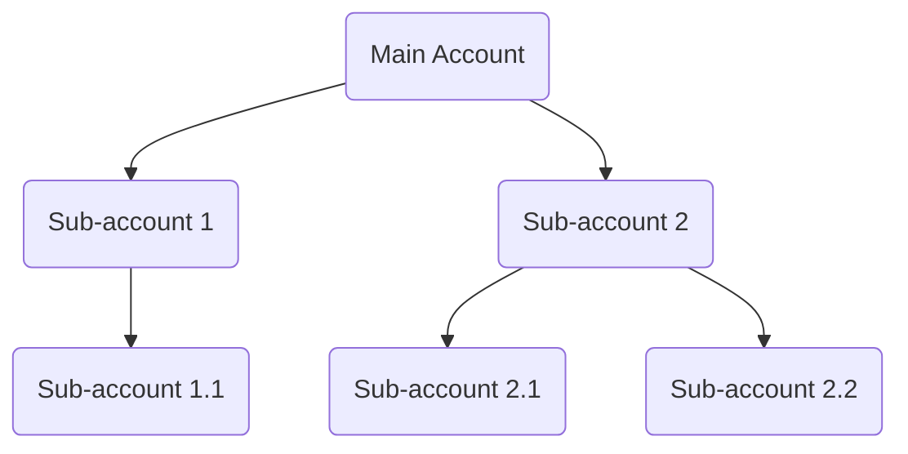

# Logix MVC Accounting APIs Documentation

This documentation provides a comprehensive overview of the Accounting (Acc) API controllers in the Logix MVC solution. Each controller is responsible for a specific domain of the accounting system, such as accounts, cost centers, banks, cash handling, journals, reports, and financial operations. The endpoints are RESTful and require permissions for access, ensuring robust security.

Below you'll find detailed explanations for each controller, including its responsibility, endpoints, usage examples, and data flow diagrams where applicable.

---

## 🌳 **BaseAccApiController**

### Purpose

All accounting API controllers inherit from `BaseAccApiController`. It defines the base route and marks all API controllers as RESTful.

```csharp
[Route($"api/{ApiConfig.ApiVersion}/Acc/[controller]")]
[ApiController]
public abstract class BaseAccApiController : ControllerBase { }
```

---

## 🧾 AccAccountController

### Overview

Manages operations for chart of accounts: searching, CRUD, loading for editing, hierarchical tree, Excel import/export, and reporting.

### Endpoints

| Name                | Method | Route                              | Description                                   |
|---------------------|--------|-------------------------------------|-----------------------------------------------|
| Search              | POST   | /api/v1/Acc/AccAccount/Search       | Searches accounts by filter                   |
| Add                 | POST   | /api/v1/Acc/AccAccount/Add          | Adds a new account                            |
| Edit                | POST   | /api/v1/Acc/AccAccount/Edit         | Edits an existing account                     |
| Delete              | DELETE | /api/v1/Acc/AccAccount/Delete       | Deletes an account                            |
| GetByIdForEdit      | GET    | /api/v1/Acc/AccAccount/GetByIdForEdit | Fetches account for editing                  |
| GetById             | GET    | /api/v1/Acc/AccAccount/GetById      | Gets account by Id                            |
| GetByCode           | GET    | /api/v1/Acc/AccAccount/GetByCode    | Gets account by code                          |
| DDLAccountParentByGroupId | GET | /api/v1/Acc/AccAccount/DDLAccountParentByGroupId | Loads parent accounts for dropdown          |
| ShowUploadAccountsExcel | POST | /api/v1/Acc/AccAccount/ShowUploadAccountsExcel | Validates Excel-uploaded accounts           |
| SaveAccountsExcel   | POST   | /api/v1/Acc/AccAccount/SaveAccountsExcel | Saves validated Excel-uploaded accounts    |
| DeleteAllAccAccounts| DELETE | /api/v1/Acc/AccAccount/DeleteAllAccAccounts | Deletes all accounts (dangerous)           |
| SearchReports       | POST   | /api/v1/Acc/AccAccount/SearchReports | Searches accounts for reports               |

### Usage Examples

#### Search Accounts

```api
{
    "title": "Search Accounts",
    "description": "Search for accounts matching filter criteria.",
    "method": "POST",
    "baseUrl": "https://api.example.com",
    "endpoint": "/api/v1/Acc/AccAccount/Search",
    "headers": [
        { "key": "Authorization", "value": "Bearer <token>", "required": true }
    ],
    "bodyType": "json",
    "requestBody": "{ \"AccAccountName\": \"Cash\", \"AccGroupId\": 1 }",
    "responses": {
        "200": {
            "description": "Success",
            "body": "{ \"data\": [ { \"AccAccountId\": 1, \"AccAccountName\": \"Cash\" } ] }"
        }
    }
}
```

#### Add New Account

```api
{
    "title": "Add Account",
    "description": "Create a new account record.",
    "method": "POST",
    "baseUrl": "https://api.example.com",
    "endpoint": "/api/v1/Acc/AccAccount/Add",
    "headers": [
        { "key": "Authorization", "value": "Bearer <token>", "required": true }
    ],
    "bodyType": "json",
    "requestBody": "{ \"AccAccountName\": \"New Account\", \"AccGroupId\": 2 }",
    "responses": {
        "200": {
            "description": "Created",
            "body": "{ \"success\": true, \"data\": { \"AccAccountId\": 123 } }"
        }
    }
}
```

#### Delete Account

```api
{
    "title": "Delete Account",
    "description": "Delete an account by its ID.",
    "method": "DELETE",
    "baseUrl": "https://api.example.com",
    "endpoint": "/api/v1/Acc/AccAccount/Delete",
    "queryParams": [
        { "key": "Id", "value": "Account Id", "required": true }
    ],
    "headers": [
        { "key": "Authorization", "value": "Bearer <token>", "required": true }
    ],
    "bodyType": "none",
    "responses": {
        "200": {
            "description": "Deleted",
            "body": "{ \"success\": true }"
        },
        "403": {
            "description": "Forbidden",
            "body": "{ \"error\": \"AccessDenied\" }"
        }
    }
}
```

### Data Flow Example

```mermaid
flowchart TD
    SearchRequest-->|Filter|AccAccountController
    AccAccountController-->|Search(filter)|AccAccountService
    AccAccountService-->|Result|AccAccountController
    AccAccountController-->|Result|Client
```

---

## 🏦 AccAccountsCostcenter

### Overview

Handles operations mapping accounts to cost centers, including search, CRUD, and retrieval by account or Id.

### Endpoints

- `POST /api/v1/Acc/AccAccountsCostcenter/Search` — Search account/cost center links
- `POST /api/v1/Acc/AccAccountsCostcenter/Add` — Add link
- `POST /api/v1/Acc/AccAccountsCostcenter/Edit` — Edit link
- `DELETE /api/v1/Acc/AccAccountsCostcenter/Delete` — Delete link by Id
- `GET /api/v1/Acc/AccAccountsCostcenter/GetByIdForEdit` — Retrieve for editing
- `GET /api/v1/Acc/AccAccountsCostcenter/GetById` — Retrieve by Id
- `GET /api/v1/Acc/AccAccountsCostcenter/GetByAccountsId` — Retrieve all cost centers for an account

### Usage Example

#### Search Account-Cost Center Links

```api
{
    "title": "Search Account-Costcenter",
    "description": "Find links between accounts and cost centers.",
    "method": "POST",
    "baseUrl": "https://api.example.com",
    "endpoint": "/api/v1/Acc/AccAccountsCostcenter/Search",
    "headers": [
        { "key": "Authorization", "value": "Bearer <token>", "required": true }
    ],
    "bodyType": "json",
    "requestBody": "{ \"AccAccountId\": 101 }",
    "responses": {
        "200": {
            "description": "Success",
            "body": "{ \"data\": [ { \"Id\": 1, \"AccAccountId\": 101, \"CcId\": 5 } ] }"
        }
    }
}
```

---

## 🏦 ACCBankUsersApiController

### Overview

Manages user permissions for bank records.

### Endpoints

- `GET /api/v1/Acc/ACCBankUsersApi/GetUsersPermissionACCBank` — Get users with permissions on a bank
- `POST /api/v1/Acc/ACCBankUsersApi/Edit` — Set users with permission
- `DELETE /api/v1/Acc/ACCBankUsersApi/Delete` — Remove a user's permission from a bank

### Usage Example

#### Get Users with Bank Permission

```api
{
    "title": "Get Users Permission for Bank",
    "description": "Get users who have permission for a bank account.",
    "method": "GET",
    "baseUrl": "https://api.example.com",
    "endpoint": "/api/v1/Acc/ACCBankUsersApi/GetUsersPermissionACCBank",
    "queryParams": [
        { "key": "id", "value": "Bank Id", "required": true }
    ],
    "headers": [
        { "key": "Authorization", "value": "Bearer <token>", "required": true }
    ],
    "bodyType": "none",
    "responses": {
        "200": {
            "description": "Success",
            "body": "{ \"data\": [ { \"Id\": 1, \"Name\": \"John\" } ] }"
        }
    }
}
```

---

## 📊 AccAccountsTreeController

### Overview

Provides tree-structured data of the chart of accounts.

### Endpoints

- `GET /api/v1/Acc/AccAccountsTree/AccountsTree` — Retrieves the full accounts tree

### Usage Example

```api
{
    "title": "Get Accounts Tree",
    "description": "Get tree structure of all accounts.",
    "method": "GET",
    "baseUrl": "https://api.example.com",
    "endpoint": "/api/v1/Acc/AccAccountsTree/AccountsTree",
    "headers": [
        { "key": "Authorization", "value": "Bearer <token>", "required": true }
    ],
    "bodyType": "none",
    "responses": {
        "200": {
            "description": "Success",
            "body": "{ \"data\": [ { \"AccountId\": 1, \"AccountName\": \"Assets\", \"Children\": [ ... ] } ] }"
        }
    }
}
```

#### Accounts Tree Diagram



---

## 🏷️ ACCCostCenterController

### Overview

CRUD and search for cost centers.

### Endpoints

- `POST /api/v1/Acc/ACCCostCenter/Search` — Search cost centers
- `POST /api/v1/Acc/ACCCostCenter/Add` — Add new cost center
- `POST /api/v1/Acc/ACCCostCenter/Edit` — Edit cost center
- `DELETE /api/v1/Acc/ACCCostCenter/Delete` — Delete cost center
- `GET /api/v1/Acc/ACCCostCenter/GetByIdForEdit` — Get for edit
- `GET /api/v1/Acc/ACCCostCenter/GetById` — Get by Id

### Usage Example

```api
{
    "title": "Add Cost Center",
    "description": "Add a new cost center.",
    "method": "POST",
    "baseUrl": "https://api.example.com",
    "endpoint": "/api/v1/Acc/ACCCostCenter/Add",
    "headers": [
        { "key": "Authorization", "value": "Bearer <token>", "required": true }
    ],
    "bodyType": "json",
    "requestBody": "{ \"CostCenterName\": \"IT Center\" }",
    "responses": {
        "200": {
            "description": "Success",
            "body": "{ \"success\": true, \"data\": { \"CcId\": 5 } }"
        }
    }
}
```

---

## 💰 AccBankController

### Overview

CRUD, search, and retrieval for bank accounts.

### Endpoints

- `GET /api/v1/Acc/AccBank/GetAll` — All banks
- `POST /api/v1/Acc/AccBank/Search` — Search
- `POST /api/v1/Acc/AccBank/Add` — Add
- `POST /api/v1/Acc/AccBank/Edit` — Edit
- `DELETE /api/v1/Acc/AccBank/Delete` — Delete
- `GET /api/v1/Acc/AccBank/GetByIdForEdit` — Get for edit
- `GET /api/v1/Acc/AccBank/GetById` — Get by Id

### Usage Example

```api
{
    "title": "Get All Banks",
    "description": "Retrieve all banks.",
    "method": "GET",
    "baseUrl": "https://api.example.com",
    "endpoint": "/api/v1/Acc/AccBank/GetAll",
    "headers": [
        { "key": "Authorization", "value": "Bearer <token>", "required": true }
    ],
    "bodyType": "none",
    "responses": {
        "200": {
            "description": "Success",
            "body": "{ \"data\": [ { \"BankId\": 1, \"BankName\": \"My Bank\" } ] }"
        }
    }
}
```

---

## 🏦 AccCashOnHandController

### Overview

Manages cash on hand (petty cash) accounts.

### Endpoints

- `GET /api/v1/Acc/AccCashOnHand/GetAll`
- `POST /api/v1/Acc/AccCashOnHand/Search`
- `POST /api/v1/Acc/AccCashOnHand/Add`
- `POST /api/v1/Acc/AccCashOnHand/Edit`
- `DELETE /api/v1/Acc/AccCashOnHand/Delete`
- `GET /api/v1/Acc/AccCashOnHand/GetByIdForEdit`
- `GET /api/v1/Acc/AccCashOnHand/GetById`

### Usage Example

```api
{
    "title": "Get Cash On Hand By Id",
    "description": "Fetch a cash on hand record by Id.",
    "method": "GET",
    "baseUrl": "https://api.example.com",
    "endpoint": "/api/v1/Acc/AccCashOnHand/GetById",
    "queryParams": [
        { "key": "id", "value": "Cash Account Id", "required": true }
    ],
    "headers": [
        { "key": "Authorization", "value": "Bearer <token>", "required": true }
    ],
    "bodyType": "none",
    "responses": {
        "200": {
            "description": "Success",
            "body": "{ \"data\": { \"Id\": 8, \"Name\": \"Main Cash\" } }"
        }
    }
}
```

---

## 🧾 AccChequeBookApiController

### Overview

Manages cheque books associated with bank accounts.

### Endpoints

- `GET /api/v1/Acc/AccChequeBookApi/GetAll`
- `GET /api/v1/Acc/AccChequeBookApi/GetByBankAll`
- `POST /api/v1/Acc/AccChequeBookApi/Add`
- `POST /api/v1/Acc/AccChequeBookApi/Edit`
- `POST /api/v1/Acc/AccChequeBookApi/Delete`
- `GET /api/v1/Acc/AccChequeBookApi/GetByIdForEdit`
- `GET /api/v1/Acc/AccChequeBookApi/GetById`

### Usage Example

```api
{
    "title": "Add Cheque Book",
    "description": "Add a cheque book for a bank account.",
    "method": "POST",
    "baseUrl": "https://api.example.com",
    "endpoint": "/api/v1/Acc/AccChequeBookApi/Add",
    "headers": [
        { "key": "Authorization", "value": "Bearer <token>", "required": true }
    ],
    "bodyType": "json",
    "requestBody": "{ \"BankId\": 1, \"StartNo\": \"1001\", \"EndNo\": \"1100\" }",
    "responses": {
        "200": {
            "description": "Created",
            "body": "{ \"success\": true }"
        }
    }
}
```

---

## 🏛️ AccAccountsLevelController

### Overview

Handles the management and update of account levels (the digit/structure of account numbers).

### Endpoints

- `GET /api/v1/Acc/AccAccountsLevel/GetAll` — List levels
- `POST /api/v1/Acc/AccAccountsLevel/Edit` — Update digit count and color for a level

### Usage Example

```api
{
    "title": "Update Account Level Digits",
    "description": "Update the digit count and color for an account level.",
    "method": "POST",
    "baseUrl": "https://api.example.com",
    "endpoint": "/api/v1/Acc/AccAccountsLevel/Edit",
    "headers": [
        { "key": "Authorization", "value": "Bearer <token>", "required": true }
    ],
    "bodyType": "json",
    "requestBody": "{ \"LevelId\": 3, \"NoOfDigit\": 5, \"Color\": \"#0000ff\" }",
    "responses": {
        "200": {
            "description": "Updated",
            "body": "{ \"success\": true }"
        }
    }
}
```

---

## 🧑‍💼 ACCCashonhandUsersApiController

### Overview

Manages user assignments to cash on hand records.

### Endpoints

- `GET /api/v1/Acc/ACCCashonhandUsersApi/GetUsersPermissionAccCashonhand`
- `POST /api/v1/Acc/ACCCashonhandUsersApi/Edit`
- `DELETE /api/v1/Acc/ACCCashonhandUsersApi/Delete`

### Usage Example

```api
{
    "title": "Get Users for Cash On Hand",
    "description": "Get users with permissions for a cash on hand record.",
    "method": "GET",
    "baseUrl": "https://api.example.com",
    "endpoint": "/api/v1/Acc/ACCCashonhandUsersApi/GetUsersPermissionAccCashonhand",
    "queryParams": [
        { "key": "id", "value": "Cash Account Id", "required": true }
    ],
    "headers": [
        { "key": "Authorization", "value": "Bearer <token>", "required": true }
    ],
    "bodyType": "none",
    "responses": {
        "200": {
            "description": "Success",
            "body": "{ \"data\": [ { \"Id\": 1, \"Name\": \"Alice\" } ] }"
        }
    }
}
```

---

## 🌳 AccCostCenterTreeApiController

### Overview

Returns a tree structure of all cost centers.

### Endpoints

- `GET /api/v1/Acc/AccCostCenterTreeApi/CostCentertTree`
- `GET /api/v1/Acc/AccCostCenterTreeApi/GetById`
- `GET /api/v1/Acc/AccCostCenterTreeApi/GetByload`
- `POST /api/v1/Acc/AccCostCenterTreeApi/Edit`
- `DELETE /api/v1/Acc/AccCostCenterTreeApi/Delete`

### Usage Example

```api
{
    "title": "Get Cost Center Tree",
    "description": "Return a tree of all cost centers for the facility.",
    "method": "GET",
    "baseUrl": "https://api.example.com",
    "endpoint": "/api/v1/Acc/AccCostCenterTreeApi/CostCentertTree",
    "headers": [
        { "key": "Authorization", "value": "Bearer <token>", "required": true }
    ],
    "bodyType": "none",
    "responses": {
        "200": {
            "description": "Tree",
            "body": "{ \"data\": [ { \"CcId\": 1, \"CostCenterName\": \"Projects\", \"Children\": [ ... ] } ] }"
        }
    }
}
```

---

## 🏢 AccFacilitiesApiController

### Overview

Facility management endpoints for searching, retrieving, and updating facility data and profile.

### Endpoints

- `POST /api/v1/Acc/AccFacilitiesApi/Search`
- `POST /api/v1/Acc/AccFacilitiesApi/GetAll`
- `GET /api/v1/Acc/AccFacilitiesApi/GetByIdForEdit`
- `POST /api/v1/Acc/AccFacilitiesApi/Edit`
- `GET /api/v1/Acc/AccFacilitiesApi/GetFacilityStamp`
- `GET /api/v1/Acc/AccFacilitiesApi/EditStamp`
- `POST /api/v1/Acc/AccFacilitiesApi/GetMyFacilityProfile`
- `POST /api/v1/Acc/AccFacilitiesApi/EditProfile`
- `POST /api/v1/Acc/AccFacilitiesApi/GetAccFacility`

### Usage Example

```api
{
    "title": "Get Facility Profile",
    "description": "Get the profile of the current facility.",
    "method": "POST",
    "baseUrl": "https://api.example.com",
    "endpoint": "/api/v1/Acc/AccFacilitiesApi/GetMyFacilityProfile",
    "headers": [
        { "key": "Authorization", "value": "Bearer <token>", "required": true }
    ],
    "bodyType": "none",
    "responses": {
        "200": {
            "description": "Facility profile",
            "body": "{ \"data\": { \"FacilityId\": 1, \"FacilityName\": \"ABC Corp\" } }"
        }
    }
}
```

---

## 📊 AccFirstTimeBalancesApiController

### Overview

Manages first time balances (opening balances) for a financial year.

### Endpoints

- `GET /api/v1/Acc/AccFirstTimeBalancesApi/GetAll`
- `POST /api/v1/Acc/AccFirstTimeBalancesApi/Search`
- `POST /api/v1/Acc/AccFirstTimeBalancesApi/Add`
- `POST /api/v1/Acc/AccFirstTimeBalancesApi/Edit`
- `DELETE /api/v1/Acc/AccFirstTimeBalancesApi/Delete`
- `GET /api/v1/Acc/AccFirstTimeBalancesApi/GetByIdForEdit`
- `GET /api/v1/Acc/AccFirstTimeBalancesApi/GetById`

### Usage Example

```api
{
    "title": "Add First Time Balance",
    "description": "Create a new first time balance entry.",
    "method": "POST",
    "baseUrl": "https://api.example.com",
    "endpoint": "/api/v1/Acc/AccFirstTimeBalancesApi/Add",
    "headers": [
        { "key": "Authorization", "value": "Bearer <token>", "required": true }
    ],
    "bodyType": "json",
    "requestBody": "{ \"JCode\": \"FTB-2024\", \"Amount\": 10000 }",
    "responses": {
        "200": {
            "description": "Created",
            "body": "{ \"success\": true }"
        }
    }
}
```

---

_This is a partial documentation. The solution includes many more API controllers for all accounting operations: journals, periods, groups, profiles, settlements, shared resources, reports, transfers, closing years, petty cash, types of expenses, and VAT groups. Each controller exposes several endpoints for CRUD and business actions. All endpoints enforce user permissions and return standardized responses._

**For a complete API reference, continue with the same format for each controller and endpoint!**

---

## System Architecture

```mermaid
flowchart LR
    subgraph API
    AccAccountController
    AccAccountsCostcenter
    AccBankController
    AccCashOnHandController
    AccChequeBookApiController
    AccAccountsLevelController
    ACCCashonhandUsersApiController
    AccCostCenterTreeApiController
    AccFacilitiesApiController
    AccFirstTimeBalancesApiController
    AcccountTypeController
    AccDashboardApiController
    AccExpensesController
    ACCFinancialYearController
    AccIncomeController
    ACCGroupController
    AccJournalApiController
    AccJournalAutoApiController
    ACCPeriodsController
    AccJournalReverseApiController
    AccProfileApiController
    AccPettyCashController
    AccPaymentDecisionApiController
    AccOpeningBalanceApiController
    AccRequestController
    AccReportsController
    AccSettlementScheduleApiController
    AccSharedController
    SettlementJournalController
    AccTransferTogeneralledgerApiController
    AccTransferFromgeneralledgerController
    ClosingFinancialYearController
    AccTypesExpensesController
    SysVatGroupController
    end

    API-->|Request/Response|DB[(Database)]
    API-->|Permissions|Auth[Authorization]
    API-->|Localization|Loc[Localization]
```



---

## 🔒 Security & Permissions

- Every endpoint checks for user permissions before executing the business logic.
- Unauthorized calls receive an `AccessDenied` response.
- All modifications require valid input and model state.

---

## 📝 Response Format

All API responses are wrapped in a standardized structure, typically like:

```json
{
    "success": true,
    "data": { ... },
    "message": ""
}
```

Errors return:

```json
{
    "success": false,
    "message": "Error description"
}
```

---

## 📚 Further Reading

- For detailed request/response models, refer to the DTO definitions.
- System configuration (e.g., account level titles, cost center visibility) is fetched dynamically based on facility.

---

**Tip:** Always use the correct HTTP method (GET, POST, DELETE) and provide the required headers, especially `Authorization`.

---

*For help, contact your API administrator or refer to the in-code XML comments for each controller.*