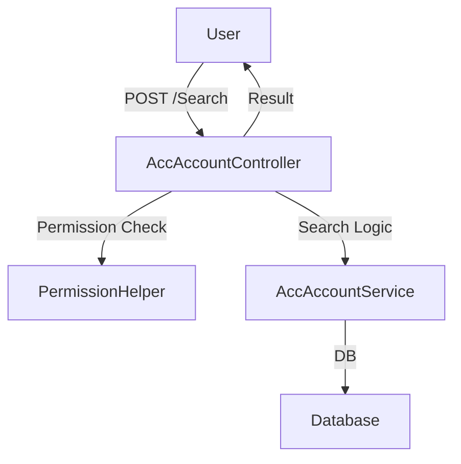
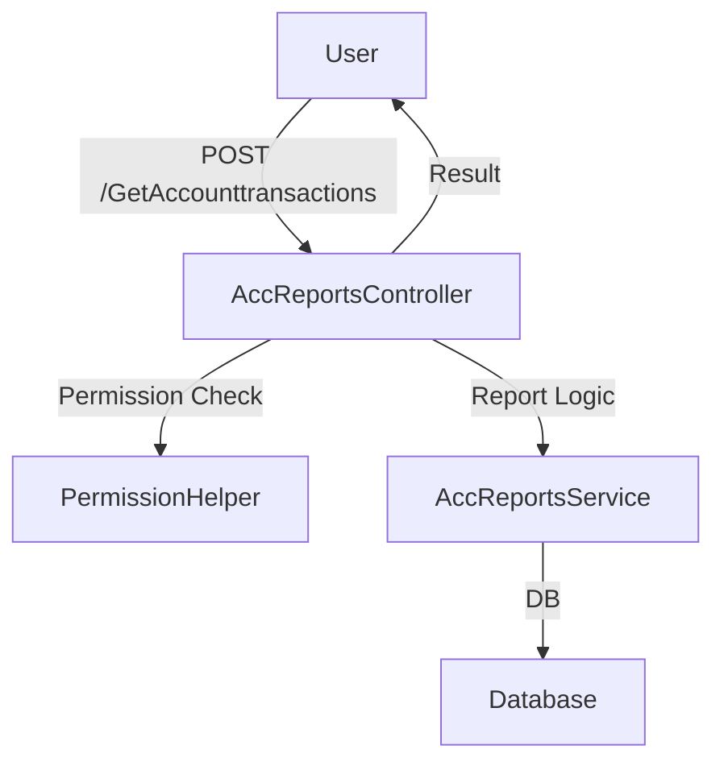
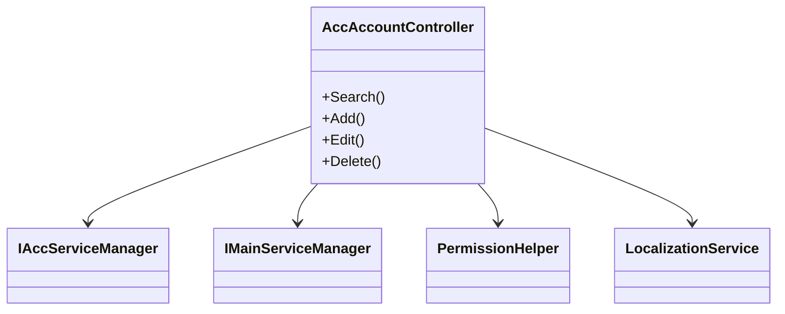

# Logix MVC - Accounting API Controllers Documentation

This documentation covers the main accounting API controllers within the Logix.MVC.LogixAPIs.Acc namespace. Each controller manages endpoints for various accounting entities such as accounts, cost centers, banks, cash on hand, financial years, journals, settlements, and more. The APIs are secured with permission checks, and follow a consistent, robust structure for data handling and error reporting.

---

## 🛠 Common Controller Structure

Most controllers:

- Inherit from `BaseAccApiController` for standardized API routing.
- Use dependency injection for services, helpers, and session/context objects.
- Check user permissions before processing logic.
- Wrap results with a `Result<T>` object for consistency.
- Handle exceptions and return friendly error messages.
- Provide CRUD and search endpoints for their specific entity.

---

## 🔒 BaseAccApiController

This is a base controller that applies the API version and routing conventions for all accounting controllers.

```csharp
[Route($"api/{ApiConfig.ApiVersion}/Acc/[controller]")]
[ApiController]
public abstract class BaseAccApiController : ControllerBase { }
```

---

## 📁 Account Controllers and Endpoints

### AccAccountController

Handles operations related to accounting accounts (chart of accounts). 

- **Search, Add, Edit, Delete accounts**
- **Get account by ID, Code, or for editing**
- **Excel import/export for bulk account management**
- **Parent account dropdowns and account trees**
- **Report-specific searches**

#### Main Flows



#### API: Search Accounts

```api
{
    "title": "Search Accounts",
    "description": "Search for accounting accounts based on filter criteria.",
    "method": "POST",
    "baseUrl": "https://api.example.com",
    "endpoint": "/api/v1/Acc/AccAccount/Search",
    "headers": [],
    "queryParams": [],
    "pathParams": [],
    "bodyType": "json",
    "requestBody": "{\n  \"AccAccountCode\": \"1001\",\n  \"AccGroupId\": 2\n}",
    "responses": {
        "200": {
            "description": "Success",
            "body": "{ \"data\": [{ \"AccAccountCode\": \"1001\", \"AccAccountName\": \"Cash\" }] }"
        }
    }
}
```

#### API: Add Account

```api
{
    "title": "Add Account",
    "description": "Add a new account.",
    "method": "POST",
    "baseUrl": "https://api.example.com",
    "endpoint": "/api/v1/Acc/AccAccount/Add",
    "bodyType": "json",
    "requestBody": "{ \"AccAccountCode\": \"2001\", \"AccAccountName\": \"Bank Account\" }",
    "responses": {
        "200": {
            "description": "Account created",
            "body": "{ \"data\": { \"AccAccountId\": 45 } }"
        }
    }
}
```

#### API: Delete Account

```api
{
    "title": "Delete Account",
    "description": "Delete an account by its ID.",
    "method": "DELETE",
    "baseUrl": "https://api.example.com",
    "endpoint": "/api/v1/Acc/AccAccount/Delete",
    "queryParams": [],
    "pathParams": [
        {"key": "Id", "value": "Account ID", "required": true}
    ],
    "bodyType": "none",
    "responses": {
        "200": {
            "description": "Account deleted",
            "body": "{ \"data\": true }"
        }
    }
}
```

---

### AccAccountsCostcenter

Manages the linking between accounts and cost centers.

- **CRUD operations for account-cost center links**
- **Search, get by account, get by ID**

#### Example: Link Account to Cost Center

```api
{
    "title": "Add Account-CostCenter Link",
    "description": "Link an account to a cost center.",
    "method": "POST",
    "baseUrl": "https://api.example.com",
    "endpoint": "/api/v1/Acc/AccAccountsCostcenter/Add",
    "bodyType": "json",
    "requestBody": "{ \"AccAccountId\": 25, \"CostCenterId\": 4 }",
    "responses": {
        "200": {
            "description": "Link added",
            "body": "{ \"data\": true }"
        }
    }
}
```

---

### AccAccountsLevelController

Controls the structure of the chart of accounts (levels, digits, colors).

- **Get all levels**
- **Update account level digit/format**

#### Example: Update Account Level Digit

```api
{
    "title": "Update Account Level Digit",
    "description": "Update digit count and color for a specific account level.",
    "method": "POST",
    "baseUrl": "https://api.example.com",
    "endpoint": "/api/v1/Acc/AccAccountsLevel/Edit",
    "bodyType": "json",
    "requestBody": "{ \"LevelId\": 2, \"NoOfDigit\": 4, \"Color\": \"#FF0000\" }",
    "responses": {
        "200": {
            "description": "Level updated",
            "body": "{ \"succeeded\": true }"
        }
    }
}
```

---

### AccAccountsTreeController

Builds and returns the hierarchical structure (tree) of accounts.

- **Get the full account tree**

```api
{
    "title": "Get Accounts Tree",
    "description": "Returns the hierarchical tree of accounts.",
    "method": "GET",
    "baseUrl": "https://api.example.com",
    "endpoint": "/api/v1/Acc/AccAccountsTree/AccountsTree",
    "bodyType": "none",
    "responses": {
        "200": {
            "description": "Accounts tree",
            "body": "{ \"data\": [ { \"AccountId\": 1, \"AccountName\": \"Assets\", \"Children\": [ ... ] } ] }"
        }
    }
}
```

---

## 🏦 Bank and Cash Controllers

### AccBankController

Manages bank records.

- **CRUD for banks**
- **Search, get by ID, editing**
- **Handles bank account mapping**

---

### AccCashOnHandController

Manages cash on hand (petty cash registers).

- **CRUD for cash boxes**
- **Search, get by ID, editing**

---

### ACCBankUsersApiController and ACCCashonhandUsersApiController

Manages permissions for users on banks/cash registers.

- **Get users with access**
- **Add, edit, remove user permissions on cash/bank**

---

## 📅 Financial Periods & Years

### ACCFinancialYearController

Handles financial year CRUD.

- **Add, edit, delete, get financial years**
- **Permission-based access**

---

### ACCPeriodsController

Handles accounting periods (monthly/quarterly, etc).

- **Add, edit, delete, get periods**
- **Permission-based access**

---

## 🧾 Journals & Balances

### AccJournalApiController

Handles generic journal entries for accounting.

- **CRUD for journals**
- **Search, review, get by ID**
- **Handles financial checks (e.g., period, cost center validation)**

---

### AccJournalAutoApiController

Handles automated journal entry processes.

- **Search, get, add, edit, delete for auto journals**
- **Uses permission checks**

---

### AccJournalReverseApiController

Handles reversed journal entries.

- **CRUD for reverse journals**
- **Get by reference/ID**

---

### AccFirstTimeBalancesApiController

Manages first-time (opening) balances for all accounts.

- **CRUD for opening balances**
- **Advanced filtering and financial validation**

---

### AccOpeningBalanceApiController

Similar to `AccFirstTimeBalancesApiController`, but for regular opening balances.

- **CRUD for opening balances**
- **Advanced filtering and financial validation**

---

## 💸 Expenses & Income

### AccExpensesController

Handles expense entries and reports.

- **CRUD for expenses**
- **Search, filter, report expenses**
- **Get expense book serials**
- **Detailed report endpoints**

---

### AccIncomeController

Handles income entries and reports.

- **CRUD for incomes**
- **Search, filter, report income**
- **Get income book serials**
- **Detailed report endpoints**

---

### AccTypesExpensesController

Manages expense types for petty cash.

- **CRUD for petty cash expense types**
- **Filter/search by name**

---

### AccPettyCashController

Handles all petty cash box activities.

- **CRUD for petty cash**
- **Create journal from petty cash**
- **Detailed report endpoints**
- **Detailed information for each petty cash transaction**

---

## 🏢 Cost Centers

### ACCCostCenterController & AccCostCenterTreeApiController

Handle cost center management and hierarchical structure.

- **CRUD for cost centers**
- **Get cost center tree**
- **Search cost centers**
- **Detailed validation and deletion checks**

---

## 📑 Cheque Books

### AccChequeBookApiController

Manages cheque books for banks.

- **CRUD for cheque books**
- **Search/get by bank**
- **Advanced filtering**

---

## 🧾 Reports & Dashboard

### AccReportsController

Handles all accounting reports:

- **Account, customer, contractor, supplier, funds, cost center, group, transaction date, trial balance, general ledger, income statement, financial center, profits/losses, cash flows, aged receivables, dashboard data**
- **Complex report filters and data aggregation**



---

### AccDashboardApiController

Returns dashboard statistics and summaries.

- **Get accounting statistics for dashboard**
- **Get predefined accounting reports**

---

## 🏁 Period Closing

### ClosingFinancialYearController

Assists with year-end operations.

- **Get all closing entries**
- **Create journal for closing financial year**
- **Get periods by year**

---

## 🔗 Shared APIs

### AccSharedController

Provides shared utility endpoints:

- **Get configuration properties**
- **Get currency, customer, journal by code**
- **Validate journal details for accounting rules**
- **Dropdowns for reference types**
- **Get files/documentation for records**

---

## 🧾 VAT & Reference Types

### SysVatGroupController

Handles VAT group management.

- **CRUD for VAT groups**
- **Get by ID, filter, search**

---

### AcccountTypeController

Handles account reference types.

- **CRUD for reference types**
- **Get by parent or all**

---

## 🔁 Transfers & Settlement

### AccTransferTogeneralledgerController & AccTransferFromgeneralledgerController

Manages bulk and status transfer of journal entries to/from the general ledger.

- **Get all eligible entries for transfer**
- **Bulk update transfer statuses**
- **Complex validation for posting**

---

### SettlementJournalController & AccSettlementScheduleApiController

Handles settlement schedules (installments, journals, etc).

- **CRUD for settlement schedules**
- **Detailed validation and get operations**
- **Create journals from settlements**

---

## 🧩 Code Structure at a Glance

### Key Service Relationships



---

## 🔐 Permission & Validation

All endpoints rely on a robust permission system:

- Each action requires a specific permission code (e.g., Show, Add, Edit, Delete).
- If permissions are insufficient, access is denied with a clear message.
- Most endpoints validate input models and return localized error messages if invalid.

---

## 📊 Data Flow Example

### Adding a New Account

1. User sends a POST to `/api/v1/Acc/AccAccount/Add`.
2. Controller checks for "Add" permission.
3. Validates the model.
4. Calls `AccAccountService.Add()`.
5. Returns success or error result.

---

## 🎯 Summary Table of Main Controllers

| Controller                      | Main Purpose                            | Core Endpoints       |
|----------------------------------|-----------------------------------------|----------------------|
| AccAccountController             | Chart of accounts CRUD                  | Search, Add, Edit    |
| AccAccountsCostcenter            | Account-cost center mapping             | Search, Add, Delete  |
| AccAccountsLevelController       | Account level structure                 | GetAll, Edit         |
| AccAccountsTreeController        | Account hierarchy/tree                  | GetAccountsTree      |
| AccBankController                | Bank management                         | Search, Add, Edit    |
| AccCashOnHandController          | Petty cash/cash management              | Search, Add, Edit    |
| ACCFinancialYearController       | Financial year management               | Search, Add, Edit    |
| ACCPeriodsController             | Accounting periods                      | Search, Add, Edit    |
| AccJournalApiController          | General journals                        | Search, Add, Edit    |
| AccJournalAutoApiController      | Automated journal entries               | Search, Add, Edit    |
| AccJournalReverseApiController   | Reversed journals                       | Search, Add, Edit    |
| AccFirstTimeBalancesApiController| First-time/opening balances             | Search, Add, Edit    |
| AccOpeningBalanceApiController   | Opening balances                        | Search, Add, Edit    |
| AccExpensesController            | Expenses management                     | Search, Add, Edit    |
| AccIncomeController              | Income management                       | Search, Add, Edit    |
| AccPettyCashController           | Petty cash transactions                 | Search, Add, Edit    |
| AccTypesExpensesController       | Petty cash/expenses types               | Search, Add, Edit    |
| SysVatGroupController            | VAT group definitions                   | Search, Add, Edit    |
| AccSharedController              | Shared utilities/validation             | Various GET/POST     |
| AccReportsController             | Full accounting reports                 | Multiple POST        |
| AccSettlementScheduleApiController| Settlements/installments               | Search, Add, Edit    |
| SettlementJournalController      | Journals for settlements                | Search, Create       |
| ClosingFinancialYearController   | Year-end closing/journals               | Search, Create       |
| AccTransferTogeneralledgerController | GL transfers                        | Search, Update       |
| AccTransferFromgeneralledgerController | GL transfers (reverse)            | Search, Update       |

---

## 🧷 Final Notes

- All controllers use dependency injection, permission checks, and localization.
- Error messages are detailed and user-friendly.
- Each endpoint has corresponding API documentation.
- The system is extensible for new modules or business rules.

---

**For further details, see the interactive API blocks and Mermaid diagrams within each section.**

---

## Appendix: Detailed Classes, Methods, and Properties

This appendix adds more details about classes, methods, and referenced properties. It complements the sections above without changing structure.

### BaseAccApiController

- Class: `BaseAccApiController`
- Purpose:
  - Define base route prefix and API behaviors.
- Key Attributes:
  - `[Route("api/{ApiConfig.ApiVersion}/Acc/[controller]")]`
  - `[ApiController]`
- Inheritance:
  - Inherits from `ControllerBase`.
- Properties: None.
- Methods: None.

### AccAccountController

- Class: `AccAccountController`
- Injected Services:
  - `IMainServiceManager`, `IAccServiceManager`, `IPermissionHelper`.
  - `IWebHostEnvironment`, `IFilesHelper`, `IDDListHelper`.
  - `ILocalizationService`, `ISysConfigurationHelper`, `ICurrentData`, `IApiDDLHelper`.
- Public Methods:
  - `Search(AccAccountFilterDto filter)`:
    - POST /Search. Permission 357 Show.
    - Returns `List<AccAccountsVw>`.
  - `Add(AccAccountDto obj)`:
    - POST /Add. Permission 357 Add.
    - Validates `ModelState`. Returns add result.
  - `Edit(AccAccountEditDto obj)`:
    - POST /Edit. Permission 357 Edit.
    - Updates account.
  - `Delete(long Id)`:
    - DELETE /Delete. Permission 357 Delete.
    - Prevents delete if children or journal details exist.
  - `GetByIdForEdit(long id)`:
    - GET /GetByIdForEdit. Returns `AccAccountEditDto`.
  - `GetById(long id)`:
    - GET /GetById. Returns `AccAccountDto`.
  - `GetAccountLevelValue(long id)`:
    - GET /GetAccountLevelValue. Returns account level + 1.
  - `DDLAccountParentByGroupId(long Id)`:
    - GET /DDLAccountParentByGroupId. Tree dropdown of parents.
  - `GetByCode(string Code)`:
    - GET /GetByCode. Look up by account code.
  - `GetCurrencyID(long id)`:
    - GET /GetCurrencyID. Returns decimal value (level + 1).
  - Excel:
    - `ShowUploadAccountsExcel(List<AccAccountExcelDto> accounts)`.
    - `SaveAccountsExcel(List<AccAccountResultExcelDto> accounts)`.
    - `DeleteAllAccAccounts()`.
  - Reports:
    - `SearchReports()`. Permission 79 Show.
- Private Helpers:
  - `BindAccountTree`, `AddChildren`, `AddGrandChildren`, `GetAccountName`.
- Referenced DTO Properties (observed):
  - `AccAccountDto`: AccAccountId, AccAccountCode, AccAccountName, AccAccountName2, AccGroupId, IsSub, IsHelpAccount.
  - `AccAccountsVw`: AccAccountId, AccAccountCode, AccAccountName, AccAccountName2, AccAccountParentId, IsSub, FlagDelete.
  - `AccAccountExcelDto`: AccAccountCode, AccountLevel, CurrencyId, CostCenterCode, IsSub, IsHelpAccount, AccAccountParentCode.
  - `AccAccountResultExcelDto`: AccAccountCode, AccAccountName, AccAccountName2, AccGroupId, Children.

### AccAccountsCostcenter

- Class: `AccAccountsCostcenter`
- Injected Services:
  - `IAccServiceManager`, `IPermissionHelper`, `ILocalizationService`, `ICurrentData`, `IApiDDLHelper`, helpers.
- Methods:
  - `Search(AccAccountsCostcenterFilterDto filter)`: POST /Search.
  - `Add(AccAccountsCostcenterDto obj)`: POST /Add.
  - `Edit(AccAccountsCostcenterEditDto obj)`: POST /Edit.
  - `Delete(long Id)`: DELETE /Delete.
  - `GetByIdForEdit(long id)`: GET /GetByIdForEdit.
  - `GetById(long id)`: GET /GetById.
  - `GetByAccountsId(long id)`: GET /GetByAccountsId.
- Referenced Properties:
  - `AccAccountsCostcenterVw`: Id, AccAccountId, IsDeleted, CcNo, CcIdFrom, CcIdTo, IsRequired.

### AccAccountsLevelController

- Class: `AccAccountsLevelController`
- Methods:
  - `GetAll()`: GET /GetAll. Permission 1149 Show.
  - `Updatedigit(long LevelId, int NoOfDigit, string Color)`: POST /Edit. Permission 1149 Edit.
- Returned DTOs:
  - `AccAccountsLevelEditDto`: used in validation and error returns.
- Properties:
  - Levels ordered by `LevelId`.

### AccAccountsTreeController

- Class: `AccAccountsTreeController`
- Methods:
  - `GetAccountsTree()`: GET /AccountsTree. Permission 61 Show.
- NonAction:
  - `GetAccountsWithChildrenRecursive(long accountId)`.
- View Models:
  - `AccountVM`: AccAccountId, AccAccountName, AccAccountParentId.
  - `AccountApiNode`: AccountId, AccountName, AccountName2, Children, Icon.

### AccBankController

- Class: `AccBankController`
- Methods:
  - `GetAll()`: GET /GetAll. Permission 63 Show.
  - `Search(AccBankFilterDto filter)`: POST /Search.
  - `Add(AccBankDto obj)`: POST /Add.
  - `Edit(AccBankEditDto obj)`: POST /Edit.
  - `Delete(long Id)`: DELETE /Delete.
  - `GetByIdForEdit(long id)`: GET /GetByIdForEdit.
  - `GetById(long id)`: GET /GetById.
- Referenced Properties:
  - `AccBankVw`: BankId, BankName, BankName2, BankAccountNo, Iban, BranchId, StatusId, FlagDelete, FacilityId.
  - `AccBankEditDto`: AccAccountId, AccountCode, AccountName.

### ACCCashonhandUsersApiController

- Class: `ACCCashonhandUsersApiController`
- Methods:
  - `GetUsersPermissionAccCashonhand(long id)`: GET.
  - `Edit(AccCashOnHandUsersDto obj)`: POST /Edit.
  - `Delete(long CashId, long Id)`: DELETE /Delete.
- Logic:
  - Reads comma-separated user IDs from `UsersPermission`.
  - Filters `SysUser` by facility and active status.
- Referenced Properties:
  - `AccCashOnHand`: UsersPermission, FacilityId, IsDeleted.
  - `AccCashOnHandUsersDto`: ID, UsersPermission.

### ACCBankUsersApiController

- Class: `ACCBankUsersApiController`
- Methods mirror cash-on-hand users controller for banks.
- Reads `UsersPermission` from `AccBank`.
- Parameters:
  - `Edit(ACCBankUsersDto obj)`: updates UsersPermission string.
  - `Delete(long BankId, long Id)`: removes target user from list.

### ACCCostCenterController

- Class: `ACCCostCenterController`
- Methods:
  - `Search(AccCostCenterFilterDto filter)`: POST /Search. Permission 658 Show.
  - `Add(AccCostCenterDto obj)`: POST /Add.
  - `Edit(AccCostCenterEditDto obj)`: POST /Edit.
  - `Delete(long Id)`: DELETE /Delete.
  - `GetByIdForEdit(long id)`: GET /GetByIdForEdit.
  - `GetById(long id)`: GET /GetById.
- DTO Properties Observed:
  - `AccCostCenterVws`: CcId, CostCenterCode, CostCenterName, CostCenterName2.
  - `AccCostCenterEditDto`: CcId, CcParentId, FacilityId.

### AccChequeBookApiController

- Class: `AccChequeBookApiController`
- Methods:
  - `GetAll()`: GET /GetAll. Permission 63 Show.
  - `GetByBankAll(long BankId)`: GET /GetByBankAll.
  - `Add(AccBankChequeBookDto obj)`: POST /Add.
  - `Edit(AccBankChequeBookEditDto obj)`: POST /Edit.
  - `Delete(int Id)`: POST /Delete.
  - `GetByIdForEdit(int id)`: GET /GetByIdForEdit.
  - `GetById(int id)`: GET /GetById.
- Properties:
  - `AccBankChequeBook`: Id, BankId, IsDeleted.

### AccDashboardApiController

- Class: `AccDashboardApiController`
- Methods:
  - `GetAccStatistics()`: GET. Returns facility and year statistics.
  - `GetAccReports()`: GET. Returns reports by system and group.
- Returned DTOs:
  - `AccStatisticsDto`, `RptReportDto`.

### AccCostCenterTreeApiController

- Class: `AccCostCenterTreeApiController`
- Methods:
  - `GetCostCentertTree()`: GET /CostCentertTree. Permission 658 Show.
  - `GetById(long id)`: GET /GetById.
  - `GetByload()`: GET /GetByload.
  - `Edit(AccCostCenterEditDto obj)`: POST /Edit.
  - `Delete(long Id)`: DELETE /Delete.
- NonAction:
  - `GetCostCenterWithChildren(long CcId)`.
- View Models:
  - `ACCCostCentertVM`, `ACCCostCenterNode`.

### AcccountTypeController

- Class: `AcccountTypeController`
- Methods:
  - `GetAll()`: GET /GetAll. Parent types only.
  - `GetByParentID(long Id)`: GET /GetByParentID.
  - `Add(AccReferenceTypeDto obj)`: POST /Add.
- Properties Observed:
  - `AccReferenceTypeDto`: ReferenceTypeId, ParentId, ReferenceTypeName, ReferenceTypeName2, FlagDelete.

### ACCGroupController

- Class: `ACCGroupController`
- Methods:
  - `GetAll()`: GET /GetAll. Permission 67 Show.
  - `Add(AccGroupDto obj)`: POST /Add.
  - `Edit(AccGroupEditDto obj)`: POST /Edit.
  - `Delete(long Id)`: DELETE /Delete.
  - `GetByIdForEdit(long id)`: GET /GetByIdForEdit.
  - `GetById(long id)`: GET /GetById.
- Properties:
  - `AccGroupDto`: AccGroupId, AccGroupName, AccGroupName2, FacilityId.

### AccFirstTimeBalancesApiController

- Class: `AccFirstTimeBalancesApiController`
- Methods:
  - `GetAll()`: GET /GetAll. DocTypeId 27.
  - `Search(AccJournalMasterfilterDto filter)`: POST /Search.
  - `Add(FirstTimeBalanceDtoVW obj)`: POST /Add.
  - `Edit(FirstTimeBalanceEditDtoVW obj)`: POST /Edit.
  - `Delete(long Id)`: DELETE /Delete.
  - `GetByIdForEdit(long id)`: GET /GetByIdForEdit.
  - `GetById(long id)`: GET /GetById.
- Key Filters Used:
  - `InsertUserId`, `PeriodId`, `JCode`, `BranchId`, `FinYear`.

### AccExpensesController

- Class: `AccExpensesController`
- Methods:
  - `GetAll()`: GET /GetAll. DocTypeId 2.
  - `Search(AccJournalMasterfilterDto filter)`: POST /Search.
  - `GetBookSerial(long branchId)`: GET /GetBookSerial.
  - `Add(AccExpensesDto obj)`: POST /Add.
  - `Edit(AccExpensesMasterEditDtoVW obj)`: POST /Edit.
  - `Delete(long Id)`: DELETE /Delete.
  - `GetByIdForEdit(long id)`: GET /GetByIdForEdit.
  - `GetById(long id)`: GET /GetById.
  - Reports:
    - `RepExpensesSearch`, `RepExpensesDetailsSearch`.
- DTO Fields Observed in View:
  - `AccJournalMasterVw`: JId, JCode, PeriodId, ReferenceNo, Amount, JDateGregorian, StatusId.
  - Details: Debit, Credit, AccAccountId, CcId, CostCenterCode, AccAccountCode, Description.

### ACCFinancialYearController

- Class: `ACCFinancialYearController`
- Methods:
  - `GetAll()`: GET /GetAll. Permission 65 Show.
  - `Add(AccFinancialYearDto obj)`: POST /Add.
  - `Edit(AccFinancialYearEditDto obj)`: POST /Edit.
  - `Delete(long Id)`: DELETE /Delete.
  - `GetByIdForEdit(long id)`: GET /GetByIdForEdit.
  - `GetById(long id)`: GET /GetById.
- Properties:
  - `AccFinancialYearDto`: FinYear, FacilityId, IsDeleted.

### AccFacilitiesApiController

- Class: `AccFacilitiesApiController`
- Methods:
  - `Search(AccFacilityFilterDto filter)`: POST /Search.
  - `GetAll()`: POST /GetAll.
  - `GetByIdForEdit(long id)`: GET /GetByIdForEdit.
  - `Edit(AccFacilityEditDto obj)`: POST /Edit.
  - `GetFacilityStamp(long id)`: GET /GetFacilityStamp.
  - `EditStamp(long id, string newStampUrl)`: GET /EditStamp.
  - `GetMyFacilityProfile()`: POST /GetMyFacilityProfile.
  - `EditProfile(AccFacilityEditProfileDto obj)`: POST /EditProfile.
  - `GetAccFacility()`: POST /GetAccFacility.
- Facility Properties Observed:
  - `AccFacilitiesVw`: FacilityId, FacilityName, FacilityName2, IdNumber, Phone, Email, Address, FlagDelete.

### AccJournalApiController

- Class: `AccJournalApiController`
- Methods:
  - `GetAll()`: GET /GetAll. DocTypeId 3.
  - `Search(AccJournalMasterfilterDto filter)`: POST /Search.
  - `Add(AccJournalMasterDtoVW obj)`: POST /Add.
  - `Edit(AccJournalMasterEditDtoVW obj)`: POST /Edit.
  - `Delete(long Id)`: DELETE /Delete.
  - `GetByIdForEdit(long id)`: GET /GetByIdForEdit.
  - `GetById(long id)`: GET /GetById.
  - `SearchReview(AccJournalMasterfilterDto filter)`: POST /SearchReview.
- Core DTO Properties:
  - `AccJournalMasterDto`: JId, JCode, PeriodId, ReferenceNo, CurrencyId, ExchangeRate, JDateGregorian, StatusId, DocTypeId.
  - `AccJournalDetaileDto`: AccAccountId, CcId, Debit, Credit, Description, ReferenceTypeId, ReferenceNo.

### AccIncomeController

- Class: `AccIncomeController`
- Methods mirror `AccExpensesController`, but DocTypeId 1.
- Methods:
  - `GetAll`, `Search`, `GetBookSerial`, `Add`, `Edit`, `Delete`, `GetByIdForEdit`, `GetById`.
  - Reports: `RepIncomeSearch`, `RepIncomeDetailsSearch`.

### AccPettyCashController

- Class: `AccPettyCashController`
- Methods:
  - `GetAll()`, `Search(AccPettyCashFilterDto)`, `Add`, `CreateJournal`, `Edit`, `Delete`.
  - `GetByIdForEdit`, `GetById`, `ReportSearchPettyCash`.
- DTO Properties:
  - `AccPettyCashVw`: Id, Code, ApplicationCode, StatusId, TypeId, PettyCashType, EmpCode, EmpName, BranchId, Description.
  - Details: ExpenseId, Amount, VatAmount, SupplierName, Total, ReferenceCode, Cc fields.

### AccOpeningBalanceApiController

- Class: `AccOpeningBalanceApiController`
- Similar to `AccFirstTimeBalancesApiController`, but DocTypeId 4.
- Methods:
  - `GetAll`, `Search`, `Add`, `Edit`, `Delete`, `GetByIdForEdit`, `GetById`.

### AccPaymentDecisionApiController

- Class: `AccPaymentDecisionApiController`
- Methods:
  - `GetAll`, `Search(AccRequestFilterDto)`, `Add(AccRequestPaymentDto)`, `Edit(AccRequestPaymentEditDto)`, `Delete`.
  - `GetByIdForEdit`, `GetById`, `GetAccType`, `GetInformationBank`, `GetRequestByAppCode`, `SelectACCJournalMaster`, `GetAccRequestByRefranceID`.
- Properties:
  - `AccRequestVw`: Id, TransTypeId, AppCode, Amount, BranchId, TypeId, DepId, StatusId, Status2Id, AccountCode, RefraneCode.

### AccJournalAutoApiController

- Class: `AccJournalAutoApiController`
- Methods:
  - `GetAll`, `Search(AccJournalMasterfilterDto)`, `Add`, `Edit`, `Delete`, `GetByIdForEdit`, `GetById`.
- Supports multiple DocTypeId via filter.
- Uses `GetAllVW` across FinYear and FacilityId.

### ACCPeriodsController

- Class: `ACCPeriodsController`
- Methods:
  - `GetAll`, `Add`, `Edit`, `Delete`, `GetByIdForEdit`, `GetById`.
- Properties:
  - `AccPeriodsDto`: PeriodId, PeriodState, FinYear, FacilityId, FlagDelete.

### AccProfileApiController

- Class: `AccProfileApiController`
- Methods:
  - `GetByIdForEdit()`: loads facility profile with mapped account codes and names.
  - `GetAll()`: list facilities.
  - `Edit(AccFacilityProfileDto obj)`: save profile mapping.
  - `EditDateProfile(long ID, int Value, long Number)`: update numeric config.
  - `EditPurchaseAccount(long ID, string AccountCode, bool UsingPurchaseAccount)`.
  - `EditVATAccount(long ID, string AccountSalesCode, string AccountPurchasesCode, bool VATEnable)`.
  - `EditAccountCode(long ID, string AccountCode, long Number)`.
  - `UpdateLogo(long ID, string FacilityLogo, long TypeId)`.
- Referenced Profile Properties:
  - Many account mapping IDs (e.g., AccountCash, AccountChequ, AccountSupplier).
  - VAT accounts for sales and purchases.
  - Feature flags (UsingPurchaseAccount, VATEnable).

### AccRequestController

- Class: `AccRequestController`
- Methods:
  - `Search(AccRequestFilterDto)`, `Add(AccRequestDto)`, `Edit(AccRequestEditDto)`, `Delete`.
  - `GetByIdForEdit`, `GetById`, `GetAccType`, `GetInformationBank`, `GetRequestByAppCode`, `SelectACCJournalMaster`, `GetAccRequestByRefranceID`.

### AccSettlementScheduleApiController

- Class: `AccSettlementScheduleApiController`
- Methods:
  - `GetAll`, `Search(AccSettlementScheduleFilterDto)`, `Add`, `Edit`, `Delete`, `GetByIdForEdit`, `GetById`, `GetDetailsById`.
  - `CheckScheduleDetaile(AccJournalDetaileDto)`: validates account and cost center rules.
- View Objects:
  - `AccSettlementScheduleDto`, `AccSettlementScheduleDDto`.

### AccJournalReverseApiController

- Class: `AccJournalReverseApiController`
- Methods:
  - `GetAll`, `Search`, `Add(AccJournalReverseDtoVW)`, `Edit(AccExpensesMasterEditDtoVW)`, `Delete`, `GetByIdForEdit`, `GetById`, `GetByReferenceId`.
- Reverse logic:
  - Details flip debit and credit in `GetByReferenceId`.

### AccReportsController

- Class: `AccReportsController`
- Methods:
  - Multiple POST endpoints for each report type.
  - Each accepts a filter DTO and returns a list of result DTOs.
- Common Filter Properties:
  - `branchId`, `ReferenceTypeId`, `CurrencyId`, `AccountLevel`, `GroupIncome`, `GroupExpenses`, date ranges.

### SettlementJournalController

- Class: `SettlementJournalController`
- Methods:
  - `GetAll`: pending installments without created journal (DocTypeId 33 filter).
  - `Search(AccSettlementInstalFilterDto)`: filter by code, branch, dates.
  - `CreateJournal(AccJournalSchedulDto)`: create journal for chosen installment.
- View Model:
  - `SettlementJournalVM`: sums of credit and debit from schedule details.

### ClosingFinancialYearController

- Class: `ClosingFinancialYearController`
- Methods:
  - `GetAll`: lists expense journals (DocTypeId 2) for the current year.
  - `Search(BalanceSheetFinancialYearFilter)`: returns balance sheet data for closing.
  - `CreateJournal(ClosingFinancialYearDto)`: generates closing journal entries.
  - `DDLAccPeriods(long FinYear)`: returns open periods for chosen year.

### AccSharedController

- Class: `AccSharedController`
- Methods:
  - `GetProperties()`: returns flags for cost center visibility and titles.
  - `GetCurrencyID(long AccountType, string code)`.
  - `GetCustomerID(long CusTypeId, string code)`.
  - `GetByJCode(string Code, int DocTypeId)`.
  - `CheckJournalDetaile(AccJournalDetaileDto)`: validates accounts and periods.
  - `GetJIDByJCode2(string JCode, int DocTypeId)`.
  - `GetCustomersName(string Name)`.
  - `GetPettyCashTemp(AccPettyCashTempVM filter)`.
  - `DDLReferenceTypebyParentId(long ParentId)`, `DDLReferenceType(string? ReferenceTypeId)`.
  - `getFilesDocument(long AppTypeId, long ScreenId)`.

### AccTransferTogeneralledgerController

- Class: `AccTransferTogeneralledgerController`
- Methods:
  - `GetAll`: journals with StatusId 1 and allowed DocType by configuration or user posting.
  - `Search(AccJournalMasterfilterDto)`: with user posting and configuration checks.
  - `UpdateTransferGeneralTo(AccJournalMasterStatusDto)`: set StatusId = 2 for selected list.
  - `UpdateTransferGeneralAllTo(AccJournalMasterStatusDto)`: bulk set to 2.
  - `UpdateACCJournalComment(AccJournalMasterStatusDto)`: set StatusId = 3 for comment.
- Status Lifecycle:
  - 1: Ready for transfer to GL.
  - 2: Transferred to GL.
  - 3: Marked for review/comment.

### AccTransferFromgeneralledgerController

- Class: `AccTransferFromgeneralledgerController`
- Methods:
  - `GetAll`: journals with StatusId 2 (already transferred).
  - `Search(AccJournalMasterfilterDto)`: delegated to `TransferFromgeneralledgerSearch`.
  - `UpdateTransferGeneralFrom(AccJournalMasterStatusDto)`: revert to StatusId = 1.
  - `UpdateTransferGeneralAllFrom(AccJournalMasterStatusDto)`: bulk revert.
- Purpose:
  - Allow unposting from GL when needed by permission.

### SysVatGroupController

- Class: `SysVatGroupController`
- Methods:
  - `GetAll`, `Search`, `Add`, `Edit`, `Delete`, `GetByIdForEdit`, `GetById`.
- VAT Group Properties:
  - `VatId`, `VatName`, `VatRate`, `SalesVatAccountId`, `PurchasesVatAccountId`.

---

## PDF Export Settings

Use these settings to export the document to a PDF with left and right margins of 1 inch.

- Recommended approach:
  - Apply print CSS with page margins.
  - Use your Markdown-to-PDF tool’s custom CSS feature.

```css
@page {
  margin-left: 1in;
  margin-right: 1in;
}
```

- If your tool supports full shorthand:

```css
@page {
  size: A4;
  margin: 1in 1in; /* top/bottom 1in, left/right 1in */
}
```

- Some tools prefer HTML wrapper. If so, ensure the print style is applied on export.