# 📦 Fixed Asset Management API Documentation

This documentation provides a comprehensive overview of the Fixed Asset Management API controllers, their endpoints, expected inputs, outputs, and usage examples. Each controller handles a specific area of the fixed assets domain, including assets, transactions, depreciation, revaluation, sales, purchases, reporting, and auxiliary data. 

## Architectural Overview

All controllers inherit from `BaseFxaApiController` and adhere to RESTful principles. Permissions are enforced on each endpoint. Data access is handled through service managers passed via dependency injection.

```mermaid
classDiagram
    class BaseFxaApiController
    class FxaBarCodeController
    class FxaDepreciationController
    class FxaAdditionsExclusionController
    class FxaFixedAssetTypeController
    class FxaAdditionsExclusionTypeController
    class FxaPurchaseController
    class FxaFixedAssetController
    class FxaFixedAssetTransferController
    class FxaReportsController
    class FxaRevaluationController
    class FxaTransactionsPaymentController
    class FxaSaleController
    class SharedController

    BaseFxaApiController <|-- FxaBarCodeController
    BaseFxaApiController <|-- FxaDepreciationController
    BaseFxaApiController <|-- FxaAdditionsExclusionController
    BaseFxaApiController <|-- FxaFixedAssetTypeController
    BaseFxaApiController <|-- FxaAdditionsExclusionTypeController
    BaseFxaApiController <|-- FxaPurchaseController
    BaseFxaApiController <|-- FxaFixedAssetController
    BaseFxaApiController <|-- FxaFixedAssetTransferController
    BaseFxaApiController <|-- FxaReportsController
    BaseFxaApiController <|-- FxaRevaluationController
    BaseFxaApiController <|-- FxaTransactionsPaymentController
    BaseFxaApiController <|-- FxaSaleController
    BaseFxaApiController <|-- SharedController
```



---

## 🏛️ BaseFxaApiController

This is the base controller class for all FXA (Fixed Asset) API controllers. It sets a common route and marks all inheriting controllers as API controllers.

```csharp
[Route($"api/{ApiConfig.ApiVersion}/FXA/[controller]")]
[ApiController]
public abstract class BaseFxaApiController : ControllerBase { }
```

- **Route Prefix**: `api/{version}/FXA/{controller}`
- **Purpose**: Ensures consistency and standardization across all FXA endpoints.

---

## 🏷️ FxaBarCodeController

**Purpose**: Manages barcode and QR code generation for fixed assets. Includes search and barcode retrieval endpoints.

### Endpoints

#### 1. Search Assets

```api
{
    "title": "Search Fixed Assets for Barcodes",
    "description": "Searches for fixed assets based on provided filters.",
    "method": "POST",
    "baseUrl": "https://api.example.com",
    "endpoint": "/api/v1/FXA/FxaBarCode/Search",
    "headers": [
        {
            "key": "Authorization",
            "value": "Bearer <token>",
            "required": true
        }
    ],
    "bodyType": "json",
    "requestBody": "{\n  \"Code\": \"1001\",\n  \"Name\": \"Vehicle\",\n  \"LocationId\": 1\n}",
    "responses": {
        "200": {
            "description": "List of filtered fixed assets",
            "body": "{\n  \"data\": [\n    {\"Id\": 1, \"No\": \"FA-001\", \"Code\": \"1001\", \"Name\": \"Vehicle\", \"Description\": \"Company car\", \"Location\": \"HQ\"}\n  ]\n}"
        }
    }
}
```

##### Parameters

- **filter**: `FxaFixedAssetFilterDto` object containing search parameters.

##### Returns

- List of fixed assets matching the filters.

##### Usage Example

```bash
curl -X POST https://api.example.com/api/v1/FXA/FxaBarCode/Search \
-H "Authorization: Bearer <token>" \
-H "Content-Type: application/json" \
-d '{"Code": "1001", "Name": "Vehicle"}'
```

---

#### 2. Get Barcodes for Assets

```api
{
    "title": "Get Barcodes and QR Codes for Fixed Assets",
    "description": "Generates barcodes and QR codes for a list of asset IDs.",
    "method": "GET",
    "baseUrl": "https://api.example.com",
    "endpoint": "/api/v1/FXA/FxaBarCode/GetBarCodes?assetsIds=1,2,3",
    "headers": [
        {
            "key": "Authorization",
            "value": "Bearer <token>",
            "required": true
        }
    ],
    "queryParams": [
        {
            "key": "assetsIds",
            "value": "Comma-separated asset IDs",
            "required": true
        }
    ],
    "bodyType": "none",
    "responses": {
        "200": {
            "description": "List of barcode and QR codes for assets",
            "body": "{\n  \"data\": [\n    {\n      \"FxaCode\": \"1001\",\n      \"FxaName\": \"Vehicle\",\n      \"CompanyLogoUrl\": \"/images/logo.jpg\",\n      \"QrCodeUrl\": \"/qrcodes/vehicle.jpg\",\n      \"BarCodeUrl\": \"/barcodes/1001.jpg\"\n    }\n  ]\n}"
        }
    }
}
```

##### Returns

- List of objects containing asset code, name, company logo, QR code, and barcode URLs.

##### Usage Example

```bash
curl -X GET "https://api.example.com/api/v1/FXA/FxaBarCode/GetBarCodes?assetsIds=1,2,3" \
-H "Authorization: Bearer <token>"
```

---

## 📉 FxaDepreciationController

**Purpose**: Handles depreciation operations for fixed assets. Functions include searching, adding, retrieving, and deleting depreciations.

### Endpoints

#### 1. Search Depreciations

```api
{
    "title": "Search Depreciation Transactions",
    "description": "Returns depreciation transactions based on filters.",
    "method": "POST",
    "baseUrl": "https://api.example.com",
    "endpoint": "/api/v1/FXA/FxaDepreciation/Search",
    "headers": [
        {
            "key": "Authorization",
            "value": "Bearer <token>",
            "required": true
        }
    ],
    "bodyType": "json",
    "requestBody": "{\n  \"Code\": \"DEP-001\",\n  \"StartDate\": \"2023/01/01\",\n  \"EndDate\": \"2023/12/31\"\n}",
    "responses": {
        "200": {
            "description": "Filtered list of depreciation transactions",
            "body": "{\n  \"data\": [\n    { \"Id\": 1, \"Code\": \"DEP-001\", \"TransDate\": \"2023/03/31\", \"Total\": 1200 } \n  ]\n}"
        }
    }
}
```

---

#### 2. Get Last Depreciation Date

```api
{
    "title": "Get Last Depreciation Date",
    "description": "Returns the last depreciation end date for the facility.",
    "method": "GET",
    "baseUrl": "https://api.example.com",
    "endpoint": "/api/v1/FXA/FxaDepreciation/GetLastDeprecDate",
    "headers": [
        {
            "key": "Authorization",
            "value": "Bearer <token>",
            "required": true
        }
    ],
    "bodyType": "none",
    "responses": {
        "200": {
            "description": "Last depreciation date",
            "body": "{\n  \"data\": \"2023/12/31\" \n}"
        }
    }
}
```

---

#### 3. Get Assets for Depreciation

```api
{
    "title": "Get Assets for Depreciation",
    "description": "Lists assets eligible for depreciation based on filters.",
    "method": "POST",
    "baseUrl": "https://api.example.com",
    "endpoint": "/api/v1/FXA/FxaDepreciation/GetAssetForDeprec",
    "headers": [
        {
            "key": "Authorization",
            "value": "Bearer <token>",
            "required": true
        }
    ],
    "bodyType": "json",
    "requestBody": "{\n  \"TypeId\": 1, \"BranchId\": 2, \"EndDate\": \"2023/12/31\", \"PeriodTypeId\": 1\n}",
    "responses": {
        "200": {
            "description": "Assets with depreciation values",
            "body": "{\n  \"data\": [\n    { \"Id\": 10, \"Name\": \"Vehicle\", \"Balance\": 10000, \"DeprecValue\": 800 } \n  ]\n}"
        }
    }
}
```

---

#### 4. Add Depreciation

```api
{
    "title": "Add Depreciation Transaction",
    "description": "Adds a new depreciation transaction for selected assets.",
    "method": "POST",
    "baseUrl": "https://api.example.com",
    "endpoint": "/api/v1/FXA/FxaDepreciation/Add",
    "headers": [
        {
            "key": "Authorization",
            "value": "Bearer <token>",
            "required": true
        }
    ],
    "bodyType": "json",
    "requestBody": "{\n  \"Assets\": [{ \"Id\": 10, \"DeprecValue\": 800 }], \"StartDate\": \"2023/01/01\", \"EndDate\": \"2023/12/31\" \n}",
    "responses": {
        "200": {
            "description": "Result of depreciation addition",
            "body": "{\n  \"success\": true, \"message\": \"Depreciation recorded successfully.\" \n}"
        }
    }
}
```

---

#### 5. Get/Update/Delete Depreciation

- **GetByIdForEdit**: Retrieves depreciation transaction for editing.
- **Delete**: Deletes a depreciation transaction by ID.

```api
{
    "title": "Get Depreciation By Id for Edit",
    "description": "Gets all data for a depreciation transaction for editing.",
    "method": "GET",
    "baseUrl": "https://api.example.com",
    "endpoint": "/api/v1/FXA/FxaDepreciation/GetByIdForEdit?id=1",
    "headers": [
        {
            "key": "Authorization",
            "value": "Bearer <token>",
            "required": true
        }
    ],
    "queryParams": [
        {
            "key": "id",
            "value": "Depreciation transaction id",
            "required": true
        }
    ],
    "bodyType": "none",
    "responses": {
        "200": {
            "description": "Depreciation details for edit",
            "body": "{ \"data\": { \"Id\": 1, \"Code\": \"DEP-001\", \"AssetList\": [ { \"FxId\": 10, \"DeprecValue\": 800 } ] } }"
        }
    }
}
```

```api
{
    "title": "Delete Depreciation",
    "description": "Deletes a depreciation transaction by its ID.",
    "method": "DELETE",
    "baseUrl": "https://api.example.com",
    "endpoint": "/api/v1/FXA/FxaDepreciation/Delete?id=1",
    "headers": [
        {
            "key": "Authorization",
            "value": "Bearer <token>",
            "required": true
        }
    ],
    "queryParams": [
        {
            "key": "id",
            "value": "Depreciation transaction id",
            "required": true
        }
    ],
    "bodyType": "none",
    "responses": {
        "200": {
            "description": "Depreciation deletion result",
            "body": "{ \"success\": true, \"message\": \"Deleted successfully.\" }"
        }
    }
}
```

---

## ➕ FxaAdditionsExclusionController

**Purpose**: Handles additions and exclusions (capitalization, disposal, etc.) for fixed assets.

### Endpoints

#### 1. Search Additions and Exclusions

```api
{
    "title": "Search Additions/Exclusions",
    "description": "Filters and lists asset additions and exclusions.",
    "method": "POST",
    "baseUrl": "https://api.example.com",
    "endpoint": "/api/v1/FXA/FxaAdditionsExclusion/Search",
    "headers": [
        {
            "key": "Authorization",
            "value": "Bearer <token>",
            "required": true
        }
    ],
    "bodyType": "json",
    "requestBody": "{\n  \"FixedAssetNo\": 1001, \"StartDate\": \"2023/01/01\", \"EndDate\": \"2023/12/31\" \n}",
    "responses": {
        "200": {
            "description": "List of additions/exclusions",
            "body": "{ \"data\": [ { \"Id\": 1, \"Date1\": \"2023/05/01\", \"FixedAssetNo\": 1001, \"TypeName\": \"Addition\", \"Description\": \"New component\", \"CreditOrDebit\": 500 } ] }"
        }
    }
}
```

---

#### 2. Add, Edit, or Delete Additions/Exclusions

- **Add**: Registers a new addition/exclusion, and generates a QR code if successful.
- **Edit**: Updates an existing record.
- **Delete**: Removes an addition/exclusion by ID.

```api
{
    "title": "Add Addition/Exclusion",
    "description": "Creates a new addition or exclusion record for a fixed asset.",
    "method": "POST",
    "baseUrl": "https://api.example.com",
    "endpoint": "/api/v1/FXA/FxaAdditionsExclusion/Add",
    "headers": [
        {
            "key": "Authorization",
            "value": "Bearer <token>",
            "required": true
        }
    ],
    "bodyType": "json",
    "requestBody": "{ \"FixedAssetNo\": 1001, \"TypeId\": 1, \"Amount\": 500, \"Date1\": \"2023/05/01\" }",
    "responses": {
        "200": {
            "description": "Addition/Exclusion result",
            "body": "{ \"success\": true, \"message\": \"Addition registered.\" }"
        }
    }
}
```

---

#### 3. Get By Id for Edit

```api
{
    "title": "Get Addition/Exclusion for Edit",
    "description": "Returns a record for editing, including journal and account info.",
    "method": "GET",
    "baseUrl": "https://api.example.com",
    "endpoint": "/api/v1/FXA/FxaAdditionsExclusion/GetByIdForEdit?id=1",
    "headers": [
        {
            "key": "Authorization",
            "value": "Bearer <token>",
            "required": true
        }
    ],
    "queryParams": [
        {
            "key": "id",
            "value": "Addition/Exclusion ID",
            "required": true
        }
    ],
    "bodyType": "none",
    "responses": {
        "200": {
            "description": "Record data for edit",
            "body": "{ \"data\": { \"Id\": 1, \"FxNo\": 1001, \"AccountCode\": \"200-01\", \"Description\": \"Extra part added\" } }"
        }
    }
}
```

---

#### 4. Get DDL for Addition/Exclusion Types

```api
{
    "title": "Get Addition/Exclusion Types DDL",
    "description": "Returns a dropdown list of addition/exclusion types.",
    "method": "GET",
    "baseUrl": "https://api.example.com",
    "endpoint": "/api/v1/FXA/FxaAdditionsExclusion/DDLFxaAddExcType?TypeId=1",
    "headers": [
        {
            "key": "Authorization",
            "value": "Bearer <token>",
            "required": true
        }
    ],
    "queryParams": [
        {
            "key": "TypeId",
            "value": "Type (1=Additions, 2=Exclusions)",
            "required": true
        }
    ],
    "bodyType": "none",
    "responses": {
        "200": {
            "description": "Dropdown list",
            "body": "{ \"data\": [ { \"Id\": 1, \"Name\": \"Addition\" } ] }"
        }
    }
}
```

---

# 📚 Summary Table

| Controller                        | Main Purpose                         | Key Endpoints                                                   |
| ---------------------------------- | ------------------------------------ | --------------------------------------------------------------- |
| FxaBarCodeController               | Barcode/QR code for assets           | Search, GetBarCodes                                             |
| FxaDepreciationController          | Depreciation process                 | Search, Add, GetLastDeprecDate                                  |
| FxaAdditionsExclusionController    | Additions/exclusions on assets       | Search, Add, Edit, Delete, DDL                                  |
| FxaFixedAssetTypeController        | Manage asset types                   | GetAll, Search, Add, Edit, Delete                               |
| FxaAdditionsExclusionTypeController| Add/Remove types for add/exclusion   | Search, Add, Edit, Delete, GetById                              |
| FxaPurchaseController              | Asset purchases                      | Search, Delete                                                  |
| FxaFixedAssetController            | Manage assets                        | Search, Add, Edit, Delete, GetProperties, FillGridViewsInEdit   |
| FxaFixedAssetTransferController    | Transfer assets                      | Search, Add, Edit, Delete, GetById, GetAssetByNo, Add2          |
| FxaReportsController               | Asset and transaction reports        | Purchase/Sale/Depreciation Reports, DDLs                        |
| FxaRevaluationController           | Asset revaluation                    | Search, Add, Delete                                             |
| FxaTransactionsPaymentController   | Payments related to assets           | Search, Add, Edit, Delete, GetById, DDL                         |
| FxaSaleController                  | Asset sale/disposal                  | Search, Add, Edit, View, Delete                                 |
| SharedController                   | Shared lookups/utilities             | GetCostCenterProperties, GetAssetDataByNo                       |

---

## 🚦 General Notes

- **Authentication**: All endpoints require a Bearer token.
- **Model Validation**: Invalid models return a message with localization support.
- **Permissions**: Each method checks for explicit permission before proceeding.
- **Error Handling**: Standardized error messages are returned on failure.

---

## Additional Full API Documentation

This section completes the full API coverage. It lists remaining endpoints with method, parameters, and return values.

### FxaAdditionsExclusionController — Edit

```api
{
    "title": "Edit Addition/Exclusion",
    "description": "Updates an existing addition or exclusion record.",
    "method": "POST",
    "baseUrl": "https://api.example.com",
    "endpoint": "/api/v1/FXA/FxaAdditionsExclusion/Edit",
    "headers": [
        { "key": "Authorization", "value": "Bearer <token>", "required": true },
        { "key": "Content-Type", "value": "application/json", "required": true }
    ],
    "bodyType": "json",
    "requestBody": "{ \"Id\": 1, \"FxNo\": 1001, \"TypeId\": 1, \"Amount\": 450, \"Date1\": \"2023/05/10\", \"Description\": \"Adjusted amount\" }",
    "responses": {
        "200": {
            "description": "Update result",
            "body": "{ \"success\": true, \"message\": \"Updated successfully.\" }"
        },
        "400": {
            "description": "Validation error",
            "body": "{ \"success\": false, \"message\": \"Data required.\" }"
        }
    }
}
```

- Parameters:
  - Id, FxNo, TypeId, Amount, Date1, Description, and accounting fields.
- Returns:
  - Operation result with status and message.

### FxaAdditionsExclusionController — Delete

```api
{
    "title": "Delete Addition/Exclusion",
    "description": "Deletes an addition or exclusion by its ID.",
    "method": "DELETE",
    "baseUrl": "https://api.example.com",
    "endpoint": "/api/v1/FXA/FxaAdditionsExclusion/Delete?id=1",
    "headers": [
        { "key": "Authorization", "value": "Bearer <token>", "required": true }
    ],
    "queryParams": [
        { "key": "id", "value": "Record ID", "required": true }
    ],
    "bodyType": "none",
    "responses": {
        "200": { "description": "Delete result", "body": "{ \"success\": true, \"message\": \"Deleted\" }" },
        "404": { "description": "Not found", "body": "{ \"success\": false, \"message\": \"Record not found\" }" }
    }
}
```

- Parameters:
  - id: record identifier.
- Returns:
  - Deletion result.

### FxaFixedAssetTypeController — Search

```api
{
    "title": "Search Asset Types",
    "description": "Filters fixed asset types by multiple criteria.",
    "method": "POST",
    "baseUrl": "https://api.example.com",
    "endpoint": "/api/v1/FXA/FxaFixedAssetType/Search",
    "headers": [
        { "key": "Authorization", "value": "Bearer <token>", "required": true },
        { "key": "Content-Type", "value": "application/json", "required": true }
    ],
    "bodyType": "json",
    "requestBody": "{ \"Code\": \"TYPE-01\", \"TypeName\": \"Vehicle\", \"ParentId\": 0, \"Age\": 5 }",
    "responses": {
        "200": {
            "description": "Filtered types",
            "body": "{ \"data\": [ { \"Id\": 1, \"Code\": \"TYPE-01\", \"TypeName\": \"Vehicles\" } ] }"
        }
    }
}
```

- Parameters:
  - Code, TypeName, ParentId, DeprecYearlyRate, Age, AccountCode*, etc.
- Returns:
  - List of matching types.

### FxaFixedAssetTypeController — GetByIdForEdit

```api
{
    "title": "Get Asset Type By Id for Edit",
    "description": "Gets a single asset type for editing.",
    "method": "GET",
    "baseUrl": "https://api.example.com",
    "endpoint": "/api/v1/FXA/FxaFixedAssetType/GetByIdForEdit?id=1",
    "headers": [
        { "key": "Authorization", "value": "Bearer <token>", "required": true }
    ],
    "queryParams": [
        { "key": "id", "value": "Asset type ID", "required": true }
    ],
    "bodyType": "none",
    "responses": {
        "200": { "description": "Type details", "body": "{ \"data\": { \"Id\": 1, \"Code\": \"TYPE-01\", \"TypeName\": \"Vehicles\" } }" }
    }
}
```

- Parameters:
  - id: type id.
- Returns:
  - DTO for editing.

### FxaFixedAssetTypeController — Edit

```api
{
    "title": "Edit Asset Type",
    "description": "Updates an existing asset type record.",
    "method": "POST",
    "baseUrl": "https://api.example.com",
    "endpoint": "/api/v1/FXA/FxaFixedAssetType/Edit",
    "headers": [
        { "key": "Authorization", "value": "Bearer <token>", "required": true },
        { "key": "Content-Type", "value": "application/json", "required": true }
    ],
    "bodyType": "json",
    "requestBody": "{ \"Id\": 1, \"Code\": \"TYPE-01\", \"TypeName\": \"Vehicles and Trucks\", \"Age\": 6 }",
    "responses": {
        "200": { "description": "Update result", "body": "{ \"success\": true }" }
    }
}
```

- Parameters:
  - Id, Code, TypeName, DeprecYearlyRate, Age, ParentId, accounts.
- Returns:
  - Operation result.

### FxaFixedAssetTypeController — Delete

```api
{
    "title": "Delete Asset Type",
    "description": "Deletes an asset type by its ID.",
    "method": "DELETE",
    "baseUrl": "https://api.example.com",
    "endpoint": "/api/v1/FXA/FxaFixedAssetType/Delete?id=1",
    "headers": [
        { "key": "Authorization", "value": "Bearer <token>", "required": true }
    ],
    "queryParams": [
        { "key": "id", "value": "Asset type ID", "required": true }
    ],
    "bodyType": "none",
    "responses": {
        "200": { "description": "Delete result", "body": "{ \"success\": true }" }
    }
}
```

- Parameters:
  - id: type identifier.
- Returns:
  - Deletion result.

### FxaAdditionsExclusionTypeController — Search

```api
{
    "title": "Search Addition/Exclusion Operation Types",
    "description": "Filters operation types by Id, TypeId, and Name.",
    "method": "POST",
    "baseUrl": "https://api.example.com",
    "endpoint": "/api/v1/FXA/FxaAdditionsExclusionType/Search",
    "headers": [
        { "key": "Authorization", "value": "Bearer <token>", "required": true },
        { "key": "Content-Type", "value": "application/json", "required": true }
    ],
    "bodyType": "json",
    "requestBody": "{ \"Id\": 0, \"TypeId\": 1, \"Name\": \"Addition\" }",
    "responses": {
        "200": { "description": "Filtered list", "body": "{ \"data\": [ { \"Id\": 1, \"Name\": \"Addition\", \"TypeName\": \"Additions\" } ] }" }
    }
}
```

- Parameters:
  - Id, TypeId, Name.
- Returns:
  - Filtered list.

### FxaAdditionsExclusionTypeController — GetByIdForEdit

```api
{
    "title": "Get Operation Type By Id for Edit",
    "description": "Retrieves a single operation type by ID for editing.",
    "method": "GET",
    "baseUrl": "https://api.example.com",
    "endpoint": "/api/v1/FXA/FxaAdditionsExclusionType/GetByIdForEdit?id=5",
    "headers": [
        { "key": "Authorization", "value": "Bearer <token>", "required": true }
    ],
    "queryParams": [
        { "key": "id", "value": "Operation type ID", "required": true }
    ],
    "bodyType": "none",
    "responses": {
        "200": { "description": "Type details", "body": "{ \"data\": { \"Id\": 5, \"Name\": \"Adjustment\", \"TypeId\": 1 } }" }
    }
}
```

- Parameters:
  - id: identifier.
- Returns:
  - DTO for edit.

### FxaAdditionsExclusionTypeController — Edit

```api
{
    "title": "Edit Operation Type",
    "description": "Updates an operation type.",
    "method": "POST",
    "baseUrl": "https://api.example.com",
    "endpoint": "/api/v1/FXA/FxaAdditionsExclusionType/Edit",
    "headers": [
        { "key": "Authorization", "value": "Bearer <token>", "required": true },
        { "key": "Content-Type", "value": "application/json", "required": true }
    ],
    "bodyType": "json",
    "requestBody": "{ \"Id\": 5, \"Name\": \"Adjustment Updated\", \"TypeId\": 2 }",
    "responses": {
        "200": { "description": "Update result", "body": "{ \"success\": true }" }
    }
}
```

- Parameters:
  - Id, Name, TypeId.
- Returns:
  - Operation result.

### FxaAdditionsExclusionTypeController — Delete

```api
{
    "title": "Delete Operation Type",
    "description": "Deletes an operation type by its ID.",
    "method": "DELETE",
    "baseUrl": "https://api.example.com",
    "endpoint": "/api/v1/FXA/FxaAdditionsExclusionType/Delete?id=5",
    "headers": [
        { "key": "Authorization", "value": "Bearer <token>", "required": true }
    ],
    "queryParams": [
        { "key": "id", "value": "Operation type ID", "required": true }
    ],
    "bodyType": "none",
    "responses": {
        "200": { "description": "Delete result", "body": "{ \"success\": true }" }
    }
}
```

- Parameters:
  - id: identifier.
- Returns:
  - Deletion result.

### FxaPurchaseController — Delete

```api
{
    "title": "Delete Purchase Transaction",
    "description": "Deletes an asset purchase transaction by ID.",
    "method": "DELETE",
    "baseUrl": "https://api.example.com",
    "endpoint": "/api/v1/FXA/FxaPurchase/Delete?id=100",
    "headers": [
        { "key": "Authorization", "value": "Bearer <token>", "required": true }
    ],
    "queryParams": [
        { "key": "id", "value": "Transaction ID", "required": true }
    ],
    "bodyType": "none",
    "responses": {
        "200": { "description": "Delete result", "body": "{ \"success\": true, \"message\": \"Deleted\" }" }
    }
}
```

- Parameters:
  - id: purchase transaction id.
- Returns:
  - Deletion result.

### FxaFixedAssetController — Search

```api
{
    "title": "Search Fixed Assets",
    "description": "Filters fixed assets by multiple criteria including type and dates.",
    "method": "POST",
    "baseUrl": "https://api.example.com",
    "endpoint": "/api/v1/FXA/FxaFixedAsset/Search",
    "headers": [
        { "key": "Authorization", "value": "Bearer <token>", "required": true },
        { "key": "Content-Type", "value": "application/json", "required": true }
    ],
    "bodyType": "json",
    "requestBody": "{ \"Code\": \"FA-1001\", \"Name\": \"Truck\", \"BranchId\": 1, \"StartDate\": \"2023/01/01\", \"EndDate\": \"2023/12/31\" }",
    "responses": {
        "200": {
            "description": "List of assets",
            "body": "{ \"data\": [ { \"Id\": 1, \"No\": 1001, \"Code\": \"FA-1001\", \"Name\": \"Truck\" } ] }"
        }
    }
}
```

- Parameters:
  - Code, Name, LocationId, BranchId, StatusId, ClassificationId, TypeId, AdditionTypeFilter, StartDate, EndDate.
- Returns:
  - Filtered asset list.

### FxaFixedAssetController — GetProperties

```api
{
    "title": "Get Asset Properties",
    "description": "Returns cost center visibility and titles for the add/edit asset pages.",
    "method": "GET",
    "baseUrl": "https://api.example.com",
    "endpoint": "/api/v1/FXA/FxaFixedAsset/GetProperties",
    "headers": [
        { "key": "Authorization", "value": "Bearer <token>", "required": true }
    ],
    "bodyType": "none",
    "responses": {
        "200": {
            "description": "Properties",
            "body": "{ \"data\": { \"CC2Visible\": true, \"CC3Visible\": false, \"CC1Title\": \"Main CC\" } }"
        }
    }
}
```

- Parameters:
  - None.
- Returns:
  - Cost center configuration.

### FxaFixedAssetController — GetAssetTypeData

```api
{
    "title": "Get Asset Type Data",
    "description": "Gets asset type financial defaults by type code for add page.",
    "method": "GET",
    "baseUrl": "https://api.example.com",
    "endpoint": "/api/v1/FXA/FxaFixedAsset/GetAssetTypeData?code=TYPE-01",
    "headers": [
        { "key": "Authorization", "value": "Bearer <token>", "required": true }
    ],
    "queryParams": [
        { "key": "code", "value": "Asset type code", "required": true }
    ],
    "bodyType": "none",
    "responses": {
        "200": {
            "description": "Type data",
            "body": "{ \"data\": { \"TypeName\": \"Vehicles\", \"AccountCode\": \"1100\", \"DeprecYearlyRate\": 20 } }"
        }
    }
}
```

- Parameters:
  - code: string type code.
- Returns:
  - Default accounts and rates.

### FxaFixedAssetController — GetByIdForEdit

```api
{
    "title": "Get Asset By Id for Edit",
    "description": "Returns a fixed asset with all edit fields populated.",
    "method": "GET",
    "baseUrl": "https://api.example.com",
    "endpoint": "/api/v1/FXA/FxaFixedAsset/GetByIdForEdit?id=101",
    "headers": [
        { "key": "Authorization", "value": "Bearer <token>", "required": true }
    ],
    "queryParams": [
        { "key": "id", "value": "Asset ID", "required": true }
    ],
    "bodyType": "none",
    "responses": {
        "200": { "description": "Asset edit DTO", "body": "{ \"data\": { \"Id\": 101, \"Code\": \"1001\", \"FxCode\": \"FA-1001\", \"EnableSave\": true } }" }
    }
}
```

- Parameters:
  - id: asset identifier.
- Returns:
  - Edit DTO including accounts and cost centers.

### FxaFixedAssetController — FillGridViewsInEdit

```api
{
    "title": "Fill Asset Edit Grids",
    "description": "Returns transaction, transfer, and additions/exclusions grids for an asset.",
    "method": "GET",
    "baseUrl": "https://api.example.com",
    "endpoint": "/api/v1/FXA/FxaFixedAsset/FillGridViewsInEdit?id=101",
    "headers": [
        { "key": "Authorization", "value": "Bearer <token>", "required": true }
    ],
    "queryParams": [
        { "key": "id", "value": "Asset ID", "required": true }
    ],
    "bodyType": "none",
    "responses": {
        "200": { "description": "Edit grids", "body": "{ \"data\": { \"FxaTransactionsAssetsVwVms\": [], \"FxaFixedAssetTransferVwVms\": [], \"FxaAdditionsExclusionVwVms\": [] } }" }
    }
}
```

- Parameters:
  - id: asset identifier.
- Returns:
  - Grids data including balances and journals.

### FxaFixedAssetController — Edit

```api
{
    "title": "Edit Fixed Asset",
    "description": "Updates a fixed asset record with edited values.",
    "method": "POST",
    "baseUrl": "https://api.example.com",
    "endpoint": "/api/v1/FXA/FxaFixedAsset/Edit",
    "headers": [
        { "key": "Authorization", "value": "Bearer <token>", "required": true },
        { "key": "Content-Type", "value": "application/json", "required": true }
    ],
    "bodyType": "json",
    "requestBody": "{ \"Id\": 101, \"Name\": \"Truck A\", \"Amount\": 32000, \"BranchId\": 1 }",
    "responses": {
        "200": { "description": "Update result", "body": "{ \"success\": true }" }
    }
}
```

- Parameters:
  - Full edit DTO fields.
- Returns:
  - Update result.

### FxaFixedAssetController — Delete

```api
{
    "title": "Delete Fixed Asset",
    "description": "Deletes a fixed asset by its ID.",
    "method": "DELETE",
    "baseUrl": "https://api.example.com",
    "endpoint": "/api/v1/FXA/FxaFixedAsset/Delete?id=101",
    "headers": [
        { "key": "Authorization", "value": "Bearer <token>", "required": true }
    ],
    "queryParams": [
        { "key": "id", "value": "Asset ID", "required": true }
    ],
    "bodyType": "none",
    "responses": {
        "200": { "description": "Delete result", "body": "{ \"success\": true }" }
    }
}
```

- Parameters:
  - id: asset identifier.
- Returns:
  - Deletion result.

### FxaFixedAssetTransferController — Search

```api
{
    "title": "Search Asset Transfers",
    "description": "Filters transfer transactions by code, names, locations, and dates.",
    "method": "POST",
    "baseUrl": "https://api.example.com",
    "endpoint": "/api/v1/FXA/FxaFixedAssetTransfer/Search",
    "headers": [
        { "key": "Authorization", "value": "Bearer <token>", "required": true },
        { "key": "Content-Type", "value": "application/json", "required": true }
    ],
    "bodyType": "json",
    "requestBody": "{ \"Code\": \"TR-001\", \"FromLocationId\": 1, \"ToLocationId\": 2, \"StartDate\": \"2023/01/01\", \"EndDate\": \"2023/12/31\" }",
    "responses": {
        "200": { "description": "Transfers", "body": "{ \"data\": [ { \"Id\": 1, \"Code\": \"TR-001\", \"FromLocationName\": \"HQ\", \"ToLocationName\": \"Branch\" } ] }" }
    }
}
```

- Parameters:
  - Code, Name, From/ToLocationId, From/ToEmpCode, StartDate, EndDate.
- Returns:
  - Transfer list.

### FxaFixedAssetTransferController — Delete

```api
{
    "title": "Delete Asset Transfer",
    "description": "Deletes a transfer record by ID.",
    "method": "DELETE",
    "baseUrl": "https://api.example.com",
    "endpoint": "/api/v1/FXA/FxaFixedAssetTransfer/Delete?id=10",
    "headers": [
        { "key": "Authorization", "value": "Bearer <token>", "required": true }
    ],
    "queryParams": [
        { "key": "id", "value": "Transfer ID", "required": true }
    ],
    "bodyType": "none",
    "responses": {
        "200": { "description": "Delete result", "body": "{ \"success\": true }" }
    }
}
```

- Parameters:
  - id: transfer id.
- Returns:
  - Deletion result.

### FxaFixedAssetTransferController — GetAssetByNo

```api
{
    "title": "Get Asset Data For Transfer",
    "description": "Gets asset origin data by asset number and facility for transfer.",
    "method": "GET",
    "baseUrl": "https://api.example.com",
    "endpoint": "/api/v1/FXA/FxaFixedAssetTransfer/GetAssetByNo?no=1001&facilityId=0",
    "headers": [
        { "key": "Authorization", "value": "Bearer <token>", "required": true }
    ],
    "queryParams": [
        { "key": "no", "value": "Asset number", "required": true },
        { "key": "facilityId", "value": "Facility ID (0=Current)", "required": true }
    ],
    "bodyType": "none",
    "responses": {
        "200": { "description": "Transfer source data", "body": "{ \"data\": { \"FromBranchId\": 1, \"FromLocationId\": 3, \"FromEmpCode\": \"E-1\" } }" }
    }
}
```

- Parameters:
  - no, facilityId.
- Returns:
  - Source branch, location, employee, and cost center.

### FxaFixedAssetTransferController — GetByIdForEdit

```api
{
    "title": "Get Transfer By Id for Edit",
    "description": "Loads a transfer record for editing.",
    "method": "GET",
    "baseUrl": "https://api.example.com",
    "endpoint": "/api/v1/FXA/FxaFixedAssetTransfer/GetByIdForEdit?id=10",
    "headers": [
        { "key": "Authorization", "value": "Bearer <token>", "required": true }
    ],
    "queryParams": [
        { "key": "id", "value": "Transfer ID", "required": true }
    ],
    "bodyType": "none",
    "responses": {
        "200": { "description": "Transfer edit DTO", "body": "{ \"data\": { \"Id\": 10, \"DateTransfer\": \"2023/06/01\", \"FromBranchId\": 1, \"ToBranchId\": 2 } }" }
    }
}
```

- Parameters:
  - id: transfer id.
- Returns:
  - Edit DTO.

### FxaFixedAssetTransferController — Edit

```api
{
    "title": "Edit Transfer",
    "description": "Updates a transfer record values and destinations.",
    "method": "POST",
    "baseUrl": "https://api.example.com",
    "endpoint": "/api/v1/FXA/FxaFixedAssetTransfer/Edit",
    "headers": [
        { "key": "Authorization", "value": "Bearer <token>", "required": true },
        { "key": "Content-Type", "value": "application/json", "required": true }
    ],
    "bodyType": "json",
    "requestBody": "{ \"Id\": 10, \"DateTransfer\": \"2023/06/05\", \"ToLocationId\": 7, \"ToEmpCode\": \"E-200\" }",
    "responses": {
        "200": { "description": "Update result", "body": "{ \"success\": true }" }
    }
}
```

- Parameters:
  - Edit DTO fields.
- Returns:
  - Update result.

### FxaFixedAssetTransferController — GetAssetsByEmpCode

```api
{
    "title": "Get Assets By Employee Code",
    "description": "Returns all active assets assigned to an employee for transfer.",
    "method": "GET",
    "baseUrl": "https://api.example.com",
    "endpoint": "/api/v1/FXA/FxaFixedAssetTransfer/GetAssetsByEmpCode?empCode=E-100&facilityId=0",
    "headers": [
        { "key": "Authorization", "value": "Bearer <token>", "required": true }
    ],
    "queryParams": [
        { "key": "empCode", "value": "Employee code", "required": true },
        { "key": "facilityId", "value": "Facility ID (0=Current)", "required": true }
    ],
    "bodyType": "none",
    "responses": {
        "200": {
            "description": "Employee assets",
            "body": "{ \"data\": [ { \"Id\": 1, \"No\": 1001, \"Code\": \"FA-1001\", \"Name\": \"Laptop\" } ] }"
        }
    }
}
```

- Parameters:
  - empCode, facilityId.
- Returns:
  - Asset list.

### FxaFixedAssetTransferController — Add2

```api
{
    "title": "Transfer Assets Between Employees",
    "description": "Transfers selected assets from one employee to another.",
    "method": "POST",
    "baseUrl": "https://api.example.com",
    "endpoint": "/api/v1/FXA/FxaFixedAssetTransfer/Add2",
    "headers": [
        { "key": "Authorization", "value": "Bearer <token>", "required": true },
        { "key": "Content-Type", "value": "application/json", "required": true }
    ],
    "bodyType": "json",
    "requestBody": "{ \"FromEmpCode\": \"E-100\", \"ToEmpCode\": \"E-200\", \"Assets\": [ { \"Id\": 1 }, { \"Id\": 2 } ], \"DateTransfer\": \"2023/07/01\" }",
    "responses": {
        "200": { "description": "Transfer result", "body": "{ \"success\": true }" }
    }
}
```

- Parameters:
  - FromEmpCode, ToEmpCode, Asset list, DateTransfer.
- Returns:
  - Operation result.

### FxaReportsController — GetSaleAssetReport

```api
{
    "title": "Get Sale Asset Report",
    "description": "Generates a report for asset sale transactions with optional filters.",
    "method": "POST",
    "baseUrl": "https://api.example.com",
    "endpoint": "/api/v1/FXA/FxaReports/GetSaleAssetReport",
    "headers": [
        { "key": "Authorization", "value": "Bearer <token>", "required": true },
        { "key": "Content-Type", "value": "application/json", "required": true }
    ],
    "bodyType": "json",
    "requestBody": "{ \"FxCode\": \"FA-1001\", \"FxName\": \"Truck\", \"LocationId\": 0, \"BranchId\": 0, \"StartDate\": \"2023/01/01\", \"EndDate\": \"2023/12/31\" }",
    "responses": {
        "200": { "description": "Sale report", "body": "{ \"data\": [ { \"FxNo\": 1001, \"FxName\": \"Truck\", \"Total\": 12000 } ] }" }
    }
}
```

- Parameters:
  - FxCode, FxName, LocationId, BranchId, StartDate, EndDate.
- Returns:
  - Sale report rows.

### FxaReportsController — GetDepreciationReport

```api
{
    "title": "Get Depreciation Report",
    "description": "Returns depreciation report for assets within a date range and filters.",
    "method": "POST",
    "baseUrl": "https://api.example.com",
    "endpoint": "/api/v1/FXA/FxaReports/GetDepreciationReport",
    "headers": [
        { "key": "Authorization", "value": "Bearer <token>", "required": true },
        { "key": "Content-Type", "value": "application/json", "required": true }
    ],
    "bodyType": "json",
    "requestBody": "{ \"StartDate\": \"2023/01/01\", \"EndDate\": \"2023/12/31\", \"BranchId\": 0, \"TypeId\": 0 }",
    "responses": {
        "200": { "description": "Depreciation data", "body": "{ \"data\": [ { \"Id\": 1, \"Name\": \"Truck\", \"DepreciationNow\": 800 } ] }" }
    }
}
```

- Parameters:
  - StartDate, EndDate, and asset filters.
- Returns:
  - Aggregated depreciation data.

### FxaReportsController — GetDepreciationReport3

```api
{
    "title": "Get Depreciation Report by Levels",
    "description": "Returns depreciation report including father and grand type names.",
    "method": "POST",
    "baseUrl": "https://api.example.com",
    "endpoint": "/api/v1/FXA/FxaReports/GetDepreciationReport3",
    "headers": [
        { "key": "Authorization", "value": "Bearer <token>", "required": true },
        { "key": "Content-Type", "value": "application/json", "required": true }
    ],
    "bodyType": "json",
    "requestBody": "{ \"StartDate\": \"2023/01/01\", \"EndDate\": \"2023/12/31\", \"TypeId\": 10 }",
    "responses": {
        "200": { "description": "Depreciation by level", "body": "{ \"data\": [ { \"Id\": 1, \"TypeName\": \"L3\", \"FatherTypeName\": \"L2\", \"GrandTypeName\": \"L1\" } ] }" }
    }
}
```

- Parameters:
  - Same as depreciation report plus type-based filtering.
- Returns:
  - Data including hierarchy names.

### FxaReportsController — GetDepreciationReport2

```api
{
    "title": "Get Depreciation Report 2",
    "description": "Filters assets with extended type hierarchy filters (TypeId, TypeId2, TypeId3).",
    "method": "POST",
    "baseUrl": "https://api.example.com",
    "endpoint": "/api/v1/FXA/FxaReports/GetDepreciationReport2",
    "headers": [
        { "key": "Authorization", "value": "Bearer <token>", "required": true },
        { "key": "Content-Type", "value": "application/json", "required": true }
    ],
    "bodyType": "json",
    "requestBody": "{ \"No\": 0, \"Code\": \"\", \"TypeId\": 0, \"TypeId2\": 0, \"TypeId3\": 0, \"StartDate\": \"2023/01/01\", \"EndDate\": \"2023/12/31\" }",
    "responses": {
        "200": { "description": "Report data", "body": "{ \"data\": [ { \"No\": 1001, \"Name\": \"Truck\", \"TypeName3\": \"Level 3\" } ] }" }
    }
}
```

- Parameters:
  - Multi-level type filters and standard asset filters.
- Returns:
  - Report rows.

### FxaReportsController — GetDepreciationReportByCategory

```api
{
    "title": "Get Depreciation Report by Category",
    "description": "Aggregates assets by category accounts and sums relevant amounts in period.",
    "method": "POST",
    "baseUrl": "https://api.example.com",
    "endpoint": "/api/v1/FXA/FxaReports/GetDepreciationReportByCategory",
    "headers": [
        { "key": "Authorization", "value": "Bearer <token>", "required": true },
        { "key": "Content-Type", "value": "application/json", "required": true }
    ],
    "bodyType": "json",
    "requestBody": "{ \"StartDate\": \"2023/01/01\", \"EndDate\": \"2023/12/31\", \"TypeId\": 0, \"BranchId\": 0 }",
    "responses": {
        "200": { "description": "Grouped results", "body": "{ \"data\": [ { \"TypeCode\": \"110\", \"Amount\": 100000, \"DepreciationNow\": 5000 } ] }" }
    }
}
```

- Parameters:
  - StartDate, EndDate, and optional filters.
- Returns:
  - Grouped report by type and accounts.

### FxaReportsController — DDLAssetType2

```api
{
    "title": "Get Level-2 Asset Types",
    "description": "Returns child asset types for a given parent type ID.",
    "method": "GET",
    "baseUrl": "https://api.example.com",
    "endpoint": "/api/v1/FXA/FxaReports/DDLAssetType2?typeId=10",
    "headers": [
        { "key": "Authorization", "value": "Bearer <token>", "required": true }
    ],
    "queryParams": [
        { "key": "typeId", "value": "Parent type ID", "required": true }
    ],
    "bodyType": "none",
    "responses": {
        "200": { "description": "Select list", "body": "{ \"data\": [ { \"Value\": 11, \"Text\": \"SubTypeA\" } ] }" }
    }
}
```

- Parameters:
  - typeId: parent type ID.
- Returns:
  - SelectList.

### FxaReportsController — DDLAssetType3

```api
{
    "title": "Get Descendant Asset Types",
    "description": "Returns all descendant types for a given type ID.",
    "method": "GET",
    "baseUrl": "https://api.example.com",
    "endpoint": "/api/v1/FXA/FxaReports/DDLAssetType3?typeId=10",
    "headers": [
        { "key": "Authorization", "value": "Bearer <token>", "required": true }
    ],
    "queryParams": [
        { "key": "typeId", "value": "Type ID", "required": true }
    ],
    "bodyType": "none",
    "responses": {
        "200": { "description": "Select list", "body": "{ \"data\": [ { \"Value\": 12, \"Text\": \"DescTypeA\" } ] }" }
    }
}
```

- Parameters:
  - typeId.
- Returns:
  - SelectList based on descendants.

### FxaRevaluationController — Search

```api
{
    "title": "Search Revaluation Transactions",
    "description": "Returns revaluation entries filtered by code, asset, branch, and date range.",
    "method": "POST",
    "baseUrl": "https://api.example.com",
    "endpoint": "/api/v1/FXA/FxaRevaluation/Search",
    "headers": [
        { "key": "Authorization", "value": "Bearer <token>", "required": true },
        { "key": "Content-Type", "value": "application/json", "required": true }
    ],
    "bodyType": "json",
    "requestBody": "{ \"Code\": \"REV-001\", \"FxNo\": 1001, \"FxName\": \"Truck\", \"BranchId\": 1, \"StartDate\": \"2023/01/01\", \"EndDate\": \"2023/12/31\" }",
    "responses": {
        "200": { "description": "Revaluations", "body": "{ \"data\": [ { \"Id\": 1, \"Code\": \"REV-001\", \"AmountOld\": 20000, \"AmountNew\": 22000 } ] }" }
    }
}
```

- Parameters:
  - Code, FxNo, FxName, BranchId, StartDate, EndDate.
- Returns:
  - Revaluation list with journal info.

### FxaRevaluationController — Delete

```api
{
    "title": "Delete Revaluation",
    "description": "Deletes a revaluation transaction by ID.",
    "method": "DELETE",
    "baseUrl": "https://api.example.com",
    "endpoint": "/api/v1/FXA/FxaRevaluation/Delete?id=50",
    "headers": [
        { "key": "Authorization", "value": "Bearer <token>", "required": true }
    ],
    "queryParams": [
        { "key": "id", "value": "Revaluation ID", "required": true }
    ],
    "bodyType": "none",
    "responses": {
        "200": { "description": "Delete result", "body": "{ \"success\": true }" }
    }
}
```

- Parameters:
  - id.
- Returns:
  - Deletion result.

### FxaTransactionsPaymentController — Search

```api
{
    "title": "Search Payment Transactions",
    "description": "Filters payments by Id, No, Code, BranchId, TransactionId, BankId, and date range.",
    "method": "POST",
    "baseUrl": "https://api.example.com",
    "endpoint": "/api/v1/FXA/FxaTransactionsPayment/Search",
    "headers": [
        { "key": "Authorization", "value": "Bearer <token>", "required": true },
        { "key": "Content-Type", "value": "application/json", "required": true }
    ],
    "bodyType": "json",
    "requestBody": "{ \"Id\": 0, \"No\": 0, \"Code\": \"PAY-001\", \"BranchId\": 1, \"PaymentDate\": \"2023/01/01\", \"PaymentDate2\": \"2023/12/31\" }",
    "responses": {
        "200": { "description": "Payments", "body": "{ \"data\": [ { \"Id\": 1, \"Code\": \"PAY-001\", \"AmountReceived\": 5000 } ] }" }
    }
}
```

- Parameters:
  - Id, No, Code, BranchId, TransactionId, BankId, PaymentDate, PaymentDate2.
- Returns:
  - Payment list.

### FxaTransactionsPaymentController — Update

```api
{
    "title": "Update Payment Transaction",
    "description": "Updates an existing payment using the edit DTO model.",
    "method": "POST",
    "baseUrl": "https://api.example.com",
    "endpoint": "/api/v1/FXA/FxaTransactionsPayment/Update",
    "headers": [
        { "key": "Authorization", "value": "Bearer <token>", "required": true },
        { "key": "Content-Type", "value": "application/json", "required": true }
    ],
    "bodyType": "json",
    "requestBody": "{ \"Id\": 1, \"Code\": \"PAY-001\", \"AmountReceived\": 5200, \"PaymentDate\": \"2023/10/02\" }",
    "responses": {
        "200": { "description": "Update result", "body": "{ \"success\": true }" }
    }
}
```

- Parameters:
  - Payment edit DTO fields.
- Returns:
  - Update result.

### FxaTransactionsPaymentController — DDLFxaAddExcType

```api
{
    "title": "Get Payment Operation Types DDL",
    "description": "Returns addition/exclusion types for a given TypeId for payment screens.",
    "method": "GET",
    "baseUrl": "https://api.example.com",
    "endpoint": "/api/v1/FXA/FxaTransactionsPayment/DDLFxaAddExcType?TypeId=1",
    "headers": [
        { "key": "Authorization", "value": "Bearer <token>", "required": true }
    ],
    "queryParams": [
        { "key": "TypeId", "value": "Type ID (1 or 2)", "required": true }
    ],
    "bodyType": "none",
    "responses": {
        "200": { "description": "Select list", "body": "{ \"data\": [ { \"Value\": 1, \"Text\": \"Addition\" } ] }" }
    }
}
```

- Parameters:
  - TypeId.
- Returns:
  - SelectList.

### FxaTransactionsPaymentController — GetByIdForEdit

```api
{
    "title": "Get Payment By Id for Edit",
    "description": "Loads payment transaction data for editing by its ID.",
    "method": "GET",
    "baseUrl": "https://api.example.com",
    "endpoint": "/api/v1/FXA/FxaTransactionsPayment/GetByIdForEdit?id=1",
    "headers": [
        { "key": "Authorization", "value": "Bearer <token>", "required": true }
    ],
    "queryParams": [
        { "key": "id", "value": "Payment ID", "required": true }
    ],
    "bodyType": "none",
    "responses": {
        "200": { "description": "Payment details", "body": "{ \"data\": { \"Id\": 1, \"Code\": \"PAY-001\", \"AmountReceived\": 5200 } }" }
    }
}
```

- Parameters:
  - id.
- Returns:
  - Payment view DTO.

### FxaTransactionsPaymentController — Edit

```api
{
    "title": "Edit Payment",
    "description": "Edits a payment transaction using the edit DTO model.",
    "method": "POST",
    "baseUrl": "https://api.example.com",
    "endpoint": "/api/v1/FXA/FxaTransactionsPayment/Edit",
    "headers": [
        { "key": "Authorization", "value": "Bearer <token>", "required": true },
        { "key": "Content-Type", "value": "application/json", "required": true }
    ],
    "bodyType": "json",
    "requestBody": "{ \"Id\": 1, \"AmountReceived\": 5300, \"PaymentDate\": \"2023/10/03\" }",
    "responses": {
        "200": { "description": "Update result", "body": "{ \"success\": true }" }
    }
}
```

- Parameters:
  - Payment edit DTO fields.
- Returns:
  - Update result.

### FxaTransactionsPaymentController — Delete

```api
{
    "title": "Delete Payment",
    "description": "Deletes a payment record by ID.",
    "method": "DELETE",
    "baseUrl": "https://api.example.com",
    "endpoint": "/api/v1/FXA/FxaTransactionsPayment/Delete?id=1",
    "headers": [
        { "key": "Authorization", "value": "Bearer <token>", "required": true }
    ],
    "queryParams": [
        { "key": "id", "value": "Payment ID", "required": true }
    ],
    "bodyType": "none",
    "responses": {
        "200": { "description": "Delete result", "body": "{ \"success\": true }" }
    }
}
```

- Parameters:
  - id.
- Returns:
  - Deletion result.

### FxaSaleController — Search

```api
{
    "title": "Search Sale Transactions",
    "description": "Filters sale (discard) transactions by code and date range.",
    "method": "POST",
    "baseUrl": "https://api.example.com",
    "endpoint": "/api/v1/FXA/FxaSale/Search",
    "headers": [
        { "key": "Authorization", "value": "Bearer <token>", "required": true },
        { "key": "Content-Type", "value": "application/json", "required": true }
    ],
    "bodyType": "json",
    "requestBody": "{ \"Code\": \"SAL-001\", \"StartDate\": \"2023/01/01\", \"EndDate\": \"2023/12/31\" }",
    "responses": {
        "200": { "description": "Sales", "body": "{ \"data\": [ { \"Id\": 1, \"Code\": \"SAL-001\", \"Total\": 12000 } ] }" }
    }
}
```

- Parameters:
  - Code, StartDate, EndDate.
- Returns:
  - Sale list.

### FxaSaleController — View

```api
{
    "title": "View Sale Transaction",
    "description": "Returns sale transaction details by ID for read-only view.",
    "method": "GET",
    "baseUrl": "https://api.example.com",
    "endpoint": "/api/v1/FXA/FxaSale/View?id=20",
    "headers": [
        { "key": "Authorization", "value": "Bearer <token>", "required": true }
    ],
    "queryParams": [
        { "key": "id", "value": "Sale transaction ID", "required": true }
    ],
    "bodyType": "none",
    "responses": {
        "200": { "description": "Sale DTO", "body": "{ \"data\": { \"Id\": 20, \"SaleAmount\": 12000, \"JCode\": \"J-123\" } }" }
    }
}
```

- Parameters:
  - id.
- Returns:
  - Sale DTO with journals and cost centers.

### FxaSaleController — GetByIdForEdit

```api
{
    "title": "Get Sale By Id for Edit",
    "description": "Loads sale transaction data for editing by its ID.",
    "method": "GET",
    "baseUrl": "https://api.example.com",
    "endpoint": "/api/v1/FXA/FxaSale/GetByIdForEdit?id=20",
    "headers": [
        { "key": "Authorization", "value": "Bearer <token>", "required": true }
    ],
    "queryParams": [
        { "key": "id", "value": "Sale transaction ID", "required": true }
    ],
    "bodyType": "none",
    "responses": {
        "200": { "description": "Sale DTO", "body": "{ \"data\": { \"Id\": 20, \"SaleAmount\": 12000 } }" }
    }
}
```

- Parameters:
  - id.
- Returns:
  - Editable DTO.

### FxaSaleController — Edit

```api
{
    "title": "Edit Sale Transaction",
    "description": "Updates a sale transaction including accounts and cost centers.",
    "method": "POST",
    "baseUrl": "https://api.example.com",
    "endpoint": "/api/v1/FXA/FxaSale/Edit",
    "headers": [
        { "key": "Authorization", "value": "Bearer <token>", "required": true },
        { "key": "Content-Type", "value": "application/json", "required": true }
    ],
    "bodyType": "json",
    "requestBody": "{ \"Id\": 20, \"SaleAmount\": 12500, \"Note\": \"Adjusted\" }",
    "responses": {
        "200": { "description": "Update result", "body": "{ \"success\": true }" }
    }
}
```

- Parameters:
  - Sale DTO.
- Returns:
  - Update result.

### FxaSaleController — Delete

```api
{
    "title": "Delete Sale Transaction",
    "description": "Deletes a sale transaction by ID.",
    "method": "DELETE",
    "baseUrl": "https://api.example.com",
    "endpoint": "/api/v1/FXA/FxaSale/Delete?id=20",
    "headers": [
        { "key": "Authorization", "value": "Bearer <token>", "required": true }
    ],
    "queryParams": [
        { "key": "id", "value": "Sale transaction ID", "required": true }
    ],
    "bodyType": "none",
    "responses": {
        "200": { "description": "Delete result", "body": "{ \"success\": true }" }
    }
}
```

- Parameters:
  - id.
- Returns:
  - Deletion result.